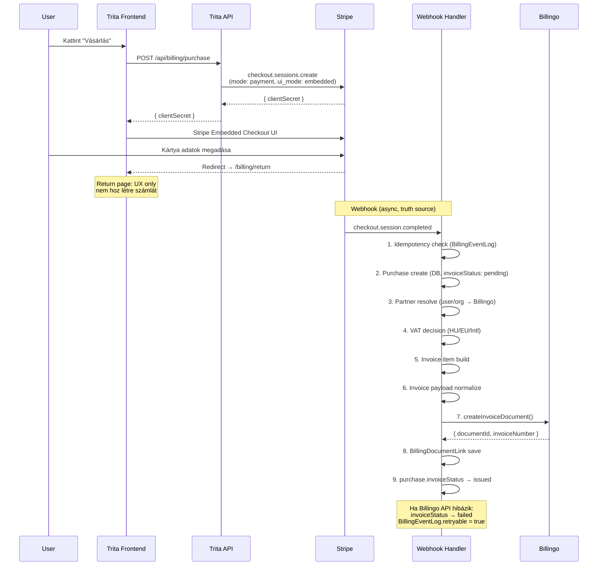
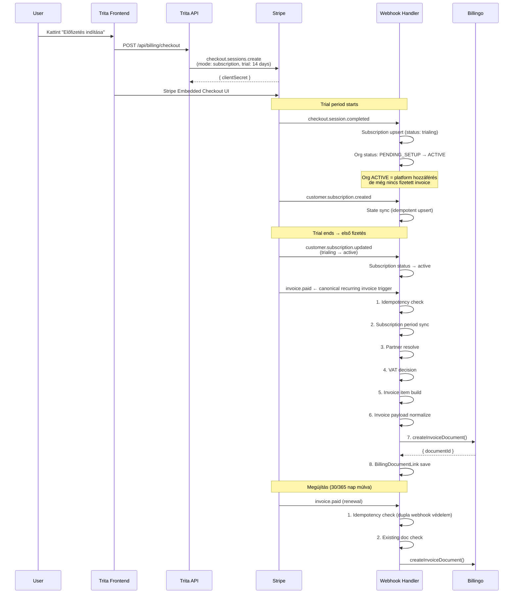
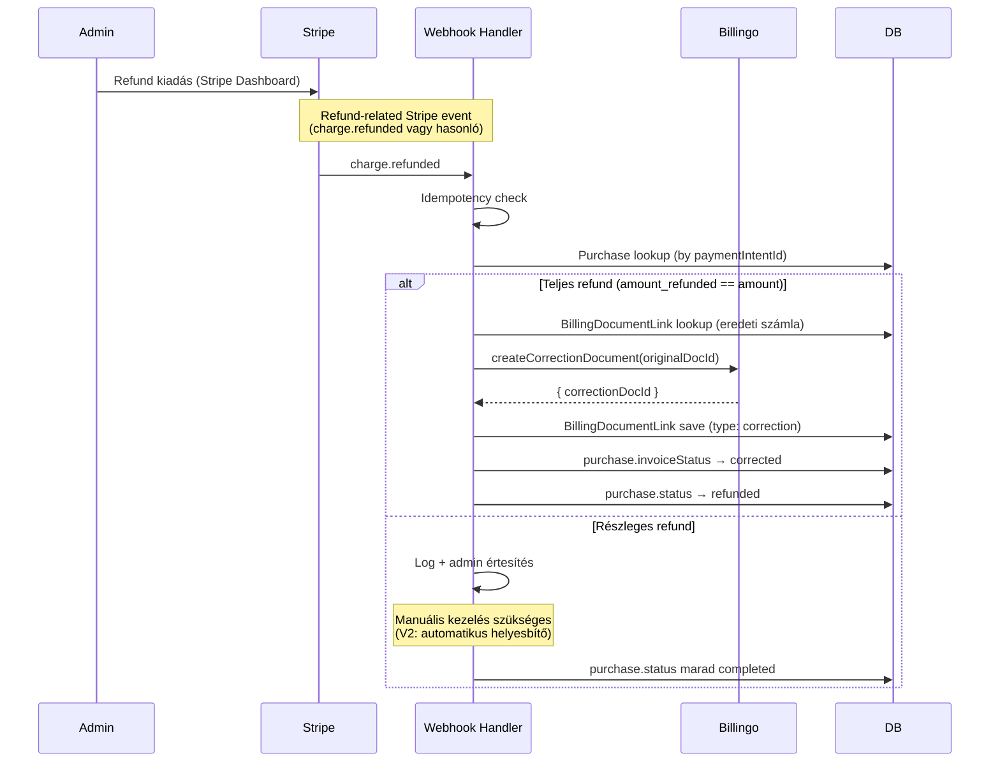
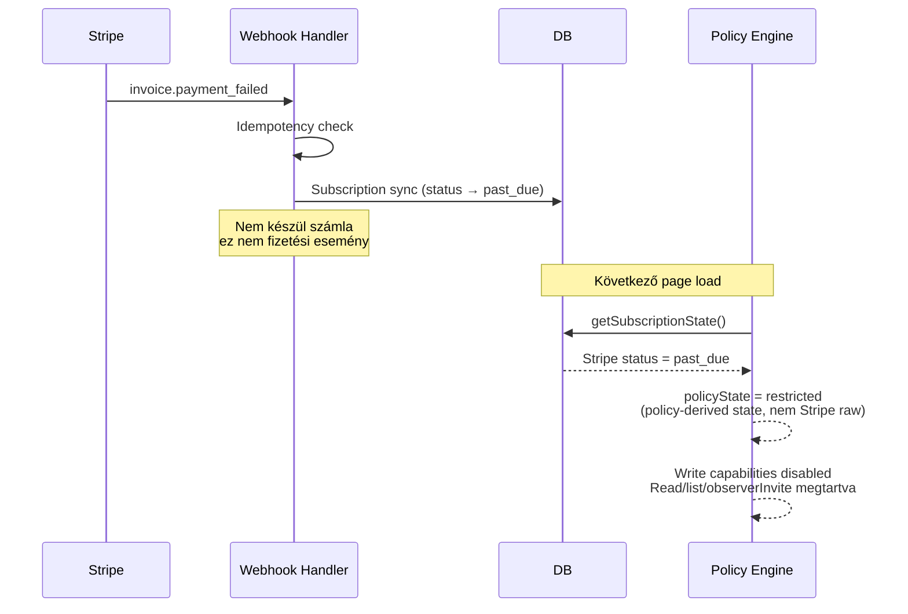
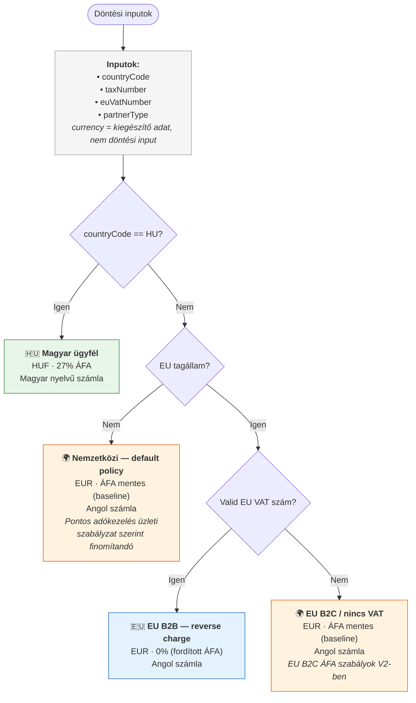
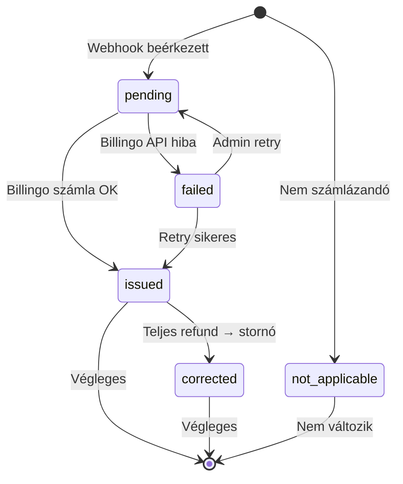

# Stripe / Billingo Architektúra Diagramok — v2

> Utolsó frissítés: 2026-04-03
> Minden diagram státusszal jelölt: ✅ implemented / 🟡 target / 🔵 conceptual

---

## 1. Rendszerarchitektúra — Három truth réteg

> ✅ Implemented baseline (handler-ek kész, Billingo API bekötés target)

```mermaid
graph TB
    subgraph "External Services"
        Stripe["☁️ Stripe<br/><i>Payment Truth</i>"]
        Billingo["☁️ Billingo<br/><i>Invoice / Compliance Truth</i>"]
        NAV["🏛️ Compliance Reporting<br/><i>Billingo → NAV automatikus</i>"]
    end

    subgraph "Trita Backend — Orchestration Truth"
        WebhookRoute["Webhook Route<br/><code>api/webhooks/stripe</code>"]
        Dispatch["Event Dispatch"]

        subgraph "Handlers"
            H_Checkout["handle-checkout-completed"]
            H_InvPaid["handle-invoice-paid"]
            H_InvFailed["handle-invoice-failed"]
            H_SubSync["handle-subscription-lifecycle"]
            H_Refund["handle-charge-refunded"]
        end

        subgraph "Service Layer"
            Metadata["stripe-metadata<br/>builder / parser"]
            VatDecision["vat-decision<br/>HU / EU B2B / Intl"]
            PartnerResolver["partner-resolver<br/>user ↔ org"]
            InvoiceItems["invoice-items<br/>product → tétel"]
            Normalizer["invoice-normalizer<br/>payload builder"]
            BillingoClient["billingo-client<br/>API v3"]
            Idempotency["idempotency<br/>BillingEventLog"]
            Retry["retry<br/>admin retry"]
            Tracing["tracing<br/>structured log"]
        end

        subgraph "Database (Prisma)"
            DB_Sub["Subscription"]
            DB_Purchase["Purchase"]
            DB_EventLog["BillingEventLog"]
            DB_PartnerLink["BillingoPartnerLink"]
            DB_DocLink["BillingDocumentLink"]
            DB_Credit["CandidateCredit"]
        end
    end

    subgraph "Trita Frontend"
        Checkout["Checkout Page<br/><code>/billing/checkout</code>"]
        Return["Return Page<br/><i>UX only — not truth source</i>"]
        Settings["Org Settings<br/><code>/org/[id]/settings</code>"]
        AdminBillingView["Admin Billing View<br/><i>reconciliation UI</i>"]
        AdminBillingAPI["Admin Billing API<br/><code>/api/admin/billing</code>"]
    end

    %% External flows
    Stripe -->|webhook events| WebhookRoute
    BillingoClient -->|API calls| Billingo
    Billingo -.->|automatic| NAV

    %% Dispatch
    WebhookRoute --> Dispatch
    Dispatch --> H_Checkout
    Dispatch --> H_InvPaid
    Dispatch --> H_InvFailed
    Dispatch --> H_SubSync
    Dispatch --> H_Refund

    %% Handler → Service (checkout — full chain)
    H_Checkout --> Idempotency
    H_Checkout --> Metadata
    H_Checkout --> PartnerResolver
    H_Checkout --> VatDecision
    H_Checkout --> InvoiceItems
    H_Checkout --> Normalizer
    H_Checkout --> BillingoClient
    H_Checkout --> Tracing

    %% Handler → Service (invoice paid — full chain, same as checkout)
    H_InvPaid --> Idempotency
    H_InvPaid --> PartnerResolver
    H_InvPaid --> VatDecision
    H_InvPaid --> InvoiceItems
    H_InvPaid --> Normalizer
    H_InvPaid --> BillingoClient
    H_InvPaid --> Tracing

    %% Handler → Service (refund)
    H_Refund --> Idempotency
    H_Refund --> BillingoClient
    H_Refund --> Tracing

    %% Handler → Service (sub sync, invoice failed — lightweight)
    H_SubSync --> Idempotency
    H_SubSync --> Tracing
    H_InvFailed --> Idempotency
    H_InvFailed --> Tracing

    %% Retry bekötés
    Retry --> DB_EventLog
    AdminBillingAPI --> Retry

    %% Service → DB
    Idempotency --> DB_EventLog
    Tracing -.-> DB_EventLog
    PartnerResolver --> DB_PartnerLink
    H_Checkout --> DB_Purchase
    H_Checkout --> DB_Credit
    H_SubSync --> DB_Sub
    H_InvPaid --> DB_Sub
    BillingoClient -.->|doc link| DB_DocLink

    %% Frontend → Stripe
    Checkout -->|Embedded Checkout| Stripe
    Return -.->|local state refresh| Settings
    Settings -->|Billing Portal| Stripe
    AdminBillingView --> AdminBillingAPI

    %% Styling
    classDef stripe fill:#635bff,stroke:#4b45c6,color:#fff
    classDef billingo fill:#1a73e8,stroke:#1557b0,color:#fff
    classDef nav fill:#9e9e9e,stroke:#616161,color:#fff
    classDef handler fill:#f3e5f5,stroke:#7b1fa2,color:#000
    classDef service fill:#e8f5e9,stroke:#2e7d32,color:#000
    classDef db fill:#fff3e0,stroke:#e65100,color:#000

    class Stripe stripe
    class Billingo billingo
    class NAV nav
    class H_Checkout,H_InvPaid,H_InvFailed,H_SubSync,H_Refund handler
    class Metadata,VatDecision,PartnerResolver,InvoiceItems,Normalizer,BillingoClient,Idempotency,Retry,Tracing service
    class DB_Sub,DB_Purchase,DB_EventLog,DB_PartnerLink,DB_DocLink,DB_Credit db
```



**v1 → v2 változások:**
- Return Page: "UX only — not truth source" jelöléssel, nem Stripe-ra nyilaz hanem local state refresh
- NAV: szürkítve, szaggatott nyíl — Billingo automatikus reportingja, nem Trita scope
- AdminBilling: szétválasztva View (frontend) és API (backend)
- Retry/Tracing: bekötve a handler-ekbe és a DB-be
- H_InvPaid: teljes service chain (VAT, items, normalizer) — konzisztens a checkout-tal
- H_SubSync és H_InvFailed: Tracing bekötés
- Handler nevek: domain action name (handle-checkout-completed, handle-subscription-lifecycle)

---

## 2. Egyszeri vásárlás flow (One-time purchase)

> ✅ Implemented baseline (Billingo API call target)



**v1 → v2 változások:**
- Stripe API hívás pontosítva: `ui_mode: embedded` (nem generic clientSecret)
- Return page explicit jelölés: "UX only — nem hoz létre számlát"
- invoiceStatus intermediate state: `pending` → `issued` (vagy `failed`)
- Billingo hiba kezelés megjegyzés hozzáadva
- Lépések számozva

---

## 3. Subscription flow (Recurring)

> ✅ Implemented (state sync kész, Billingo invoice target)



**v1 → v2 változások:**
- Org ACTIVE != fizetett: megjegyzés hozzáadva ("platform hozzáférés, de nincs invoice")
- Order confirmation email eltávolítva az updated handler-ből — kontextusfüggő, nem diagram szintű
- `invoice.paid` explicit jelölés: "canonical recurring invoice trigger"
- Renewal: idempotency + existing doc check explicit
- A teljes invoice chain konzisztens a one-time flow-val (7 lépés)

---

## 4. Refund / stornó flow

> 🟡 Target architecture (handler kész, Billingo bekötés target)



**v1 → v2 változások:**
- Event jelölés: "charge.refunded vagy hasonló" — implementation-dependent megjegyzés
- invoiceStatus: `voided` → `corrected` (pontosabb fogalom)
- Részleges refund: "V2: automatikus helyesbítő" megjegyzés
- Teljes refund státuszok pontosítva

---

## 5. Payment failure flow

> ✅ Implemented



**v1 → v2 változások:**
- "Nem készül számla" explicit megjegyzés
- policyState = restricted: "policy-derived state, nem Stripe raw" jelölés
- Capabilities: explicit mely capabilities maradnak (read/list/observerInvite)

---

## 6. Adatmodell kapcsolatok

> ✅ Implemented

```mermaid
erDiagram
    Organization ||--o| Subscription : has
    Organization ||--o{ CandidateCredit : tracks

    Subscription {
        string stripeCustomerId
        string stripeSubscriptionId
        string stripeLatestInvoiceId
        string planType
        string billingInterval
        string status
        string billingoLastDocumentId
    }

    Purchase {
        string stripeCheckoutSessionId
        string stripePaymentIntentId
        string productType
        int grossAmount
        string billingoDocumentId
        string invoiceStatus
    }

    BillingEventLog {
        string eventId UK
        string eventType
        string objectId
        string status
        boolean retryable
        int retryCount
    }

    BillingoPartnerLink {
        string billingoPartnerId UK
        string userId FK_nullable
        string organizationId FK_nullable
        string countryCode
        string taxNumber
    }

    BillingDocumentLink {
        string sourceType
        string sourceId
        string stripeInvoiceId
        string billingoDocumentId
        string documentType
        string status
    }

    UserProfile ||--o{ Purchase : makes
    Purchase ||--o{ BillingDocumentLink : "invoice/correction"
    Subscription ||--o{ BillingDocumentLink : "recurring invoices"
    BillingEventLog ..o{ BillingDocumentLink : "event triggers document"

    BillingoPartnerLink }o..|| UserProfile : "self purchases (userId)"
    BillingoPartnerLink }o..|| Organization : "org purchases (organizationId)"

    Purchase ..o{ CandidateCredit : "candidate_pack → credits"
```

**v1 → v2 változások:**
- BillingEventLog → BillingDocumentLink: implicit kapcsolat jelölve ("event triggers document")
- BillingoPartnerLink: nullable FK-k explicit jelölve (userId FK_nullable, organizationId FK_nullable)
- Purchase → CandidateCredit: implicit kapcsolat jelölve ("candidate_pack → credits")
- Purchase → BillingDocumentLink: "invoice/correction" címkével (nem csak "invoice link")

---

## 7. VAT decision tree

> ✅ Implemented baseline — döntési inputok és korlátok dokumentálva



**v1 → v2 változások:**
- Döntési inputok explicit listázva a diagram tetején (countryCode, taxNumber, euVatNumber, partnerType)
- Currency: "kiegészítő adat, nem döntési input" megjegyzés
- EU B2C ág szétválasztva az Intl-től (EU ország de nincs VAT → külön ág V2 jelöléssel)
- Intl: "default policy" + "pontos adókezelés szabályzat szerint finomítandó"
- EU B2C: "EU B2C ÁFA szabályok V2-ben" megjegyzés

---

## Invoice status állapotgép

> ✅ Implemented (Purchase.invoiceStatus)



> Ez a Purchase.invoiceStatus mező állapotgépe. A `failed` → `pending` átmenet admin retry-ból történik.
