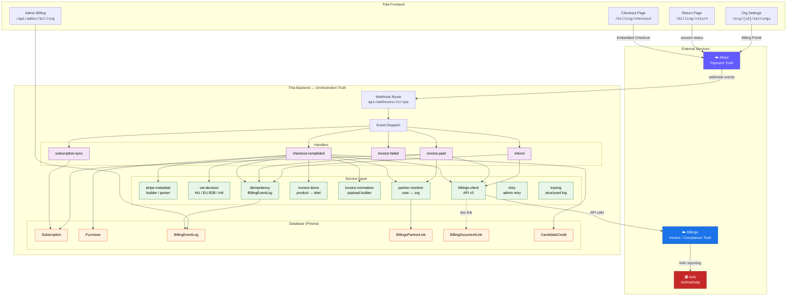
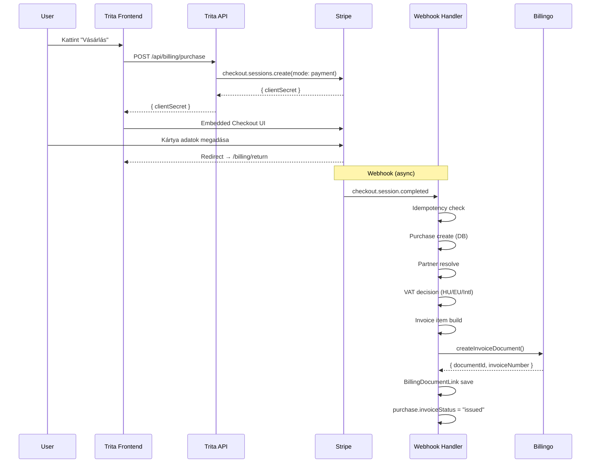
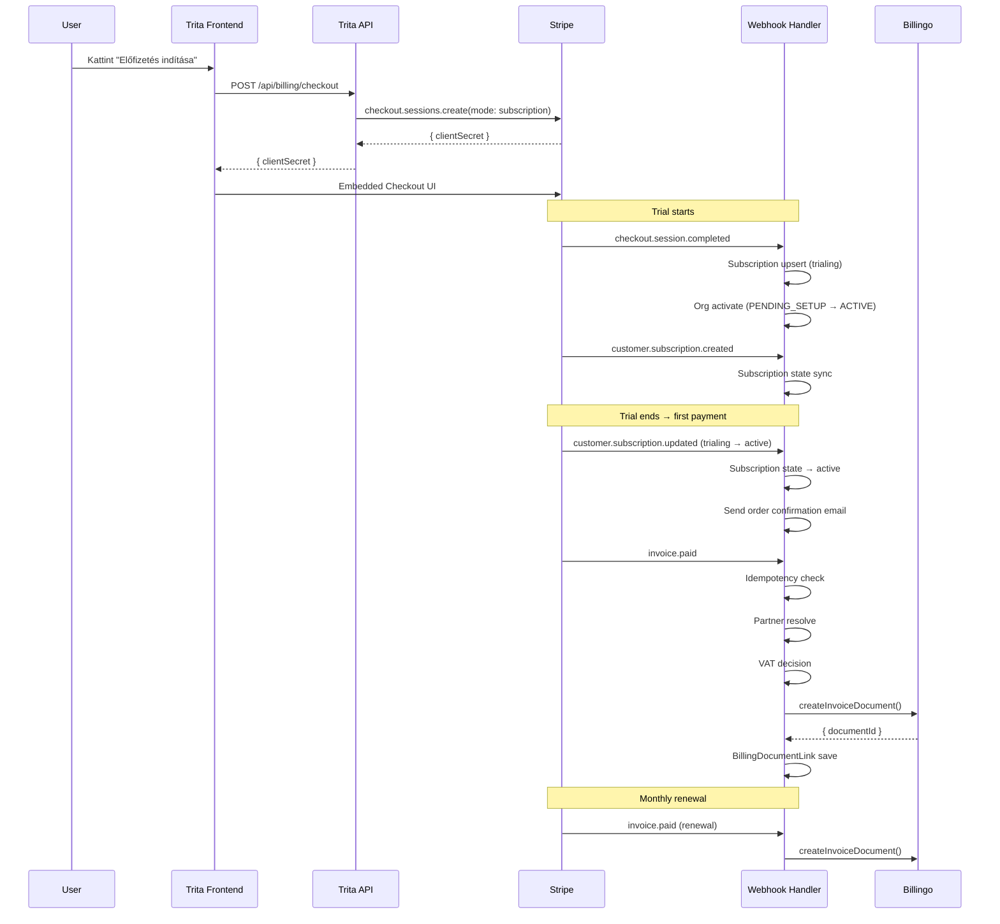
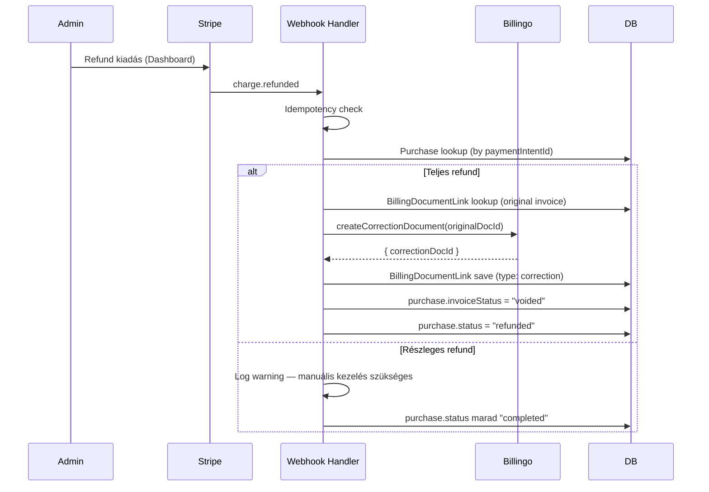
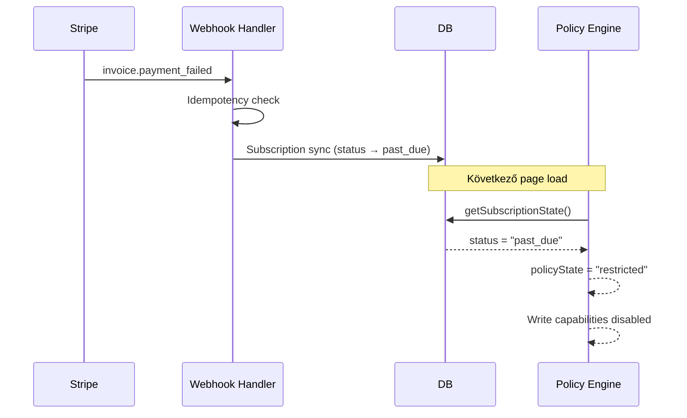
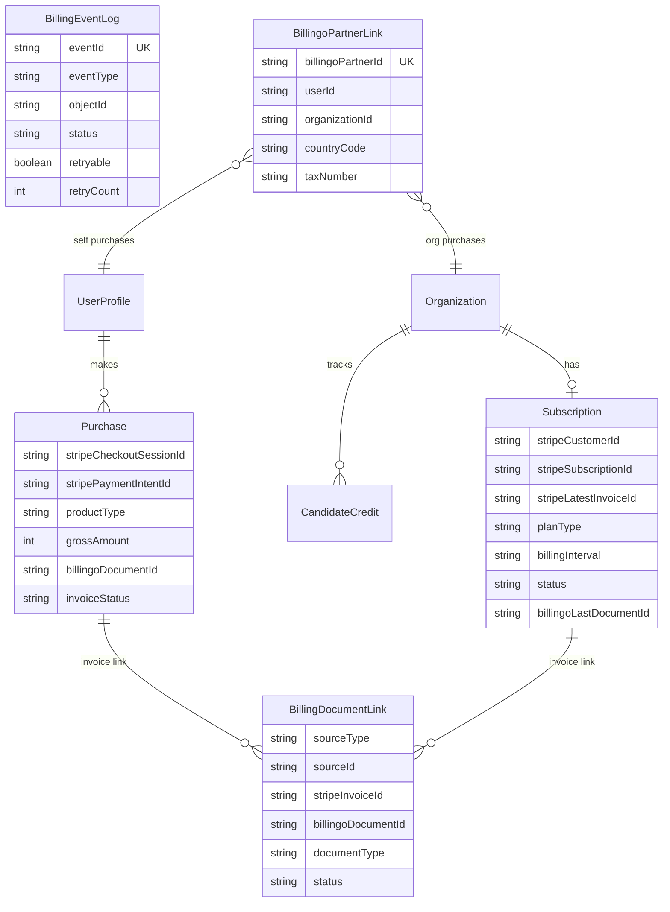
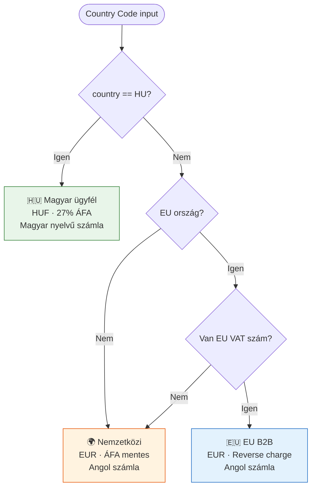

# Stripe / Billingo Architektúra Diagramok

---

## 1. Rendszerarchitektúra — Három truth réteg

---

## 2. Egyszeri vásárlás flow (One-time purchase)

---

## 3. Subscription flow (Recurring)

---

## 4. Refund / stornó flow

---

## 5. Payment failure flow

---

## 6. Adatmodell kapcsolatok

---

## 7. VAT decision tree

