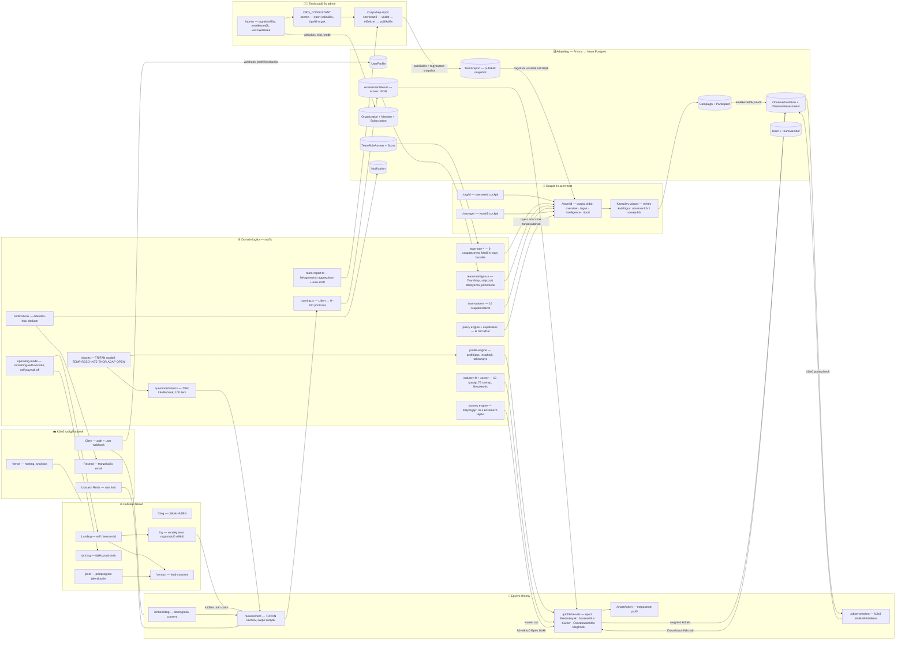
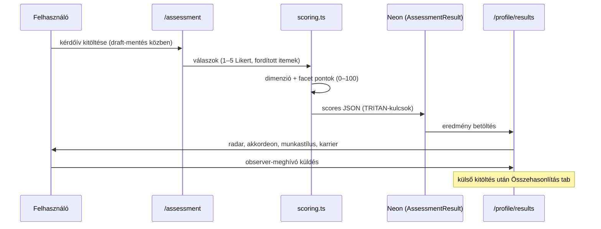
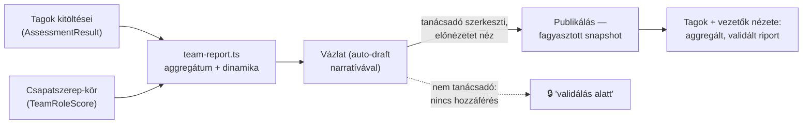

# Trita — teljes rendszertérkép (2026-07-16)

Ez a dokumentum a teljes projekt moduljait és kapcsolataikat mutatja be egy
átfogó ábrán és rétegenkénti magyarázattal. A cél: egyetlen helyen érthető
legyen, mi miből épül fel és mi mivel beszél.

## A nagy kép

## Hogyan olvasd

A rendszer egy Next.js 16 App Router alkalmazás a Vercelen, Neon Postgres
adatbázissal (Prisma ORM), Clerk autentikációval és Resend emaillel. A
felület három „világra" oszlik — egyéni, csapat/szervezeti és
tanácsadói/admin — és mindhárom ugyanarra a domain-logika rétegre
(`src/lib`) támaszkodik. Az üzleti mód **consulting-led**: fizetés a
platformon kívül, a hozzáférést a trita admin adja, a csapateredményeket
tanácsadó validálja publikálás előtt.

## Rétegek és felelősségeik

### 1. Publikus felület

A landing két módban él (`?mode=self|team`), a hero panelek a valódi
riportok kicsinyített másai. A `/try` regisztráció nélküli kitöltést enged,
az eredmény claim-mel köthető fiókhoz. A `/pilot` a pilotprogram
kvalifikáló űrlapja, a `/contact` az összes team-CTA célpontja (lead).
A blog MDX-alapú (`content/blog`, `lib/blog.ts`), HU/EN cikkpárokkal.

### 2. Egyéni élmény (self)

Az út: onboarding (consent + demográfia) → assessment (TSFI kérdésbank,
swipe-olható Likert-kártyák, draft-mentéssel) → eredmény oldal. A
`/profile/results` öt tabja: Eredmények (radar + dimenzió-akkordeon),
Munkastílus, Karrier (Karrier-iránytű wizard + fejlődési terv),
Összehasonlítás (self vs observer), Meghívók. Az observer-kör: a user
meghívót küld, a külső értékelő a `/observe/[token]` alatt tölt ki, az
eredmény visszafolyik az összehasonlításba.

### 3. Csapat és szervezet

Az org cockpit (`/org/[id]`) a szervezet admin/manager nézete: tagok,
csapatok, kampányok. A kampány a „mérés-katalógus": observer-kör (360°)
vagy csapatszerep-kör indítható célzottan, a wizard 4 lépésben. A csapat
oldal tabjai a kitöltöttségtől és a szereptől függően nyílnak — **a nyers
csapatadat csak tanácsadónak látszik**, mindenki más a publikált riportot
kapja (kapuzás: policy engine).

### 4. Tanácsadó és admin

Az `ORG_CONSULTANT` szerep admin-paritású hozzáférést ad az ügyfél-orgban:
kampányt indít, riportot szerkeszt (auto-draft a mért adatokból), előnézetet
néz, publikál — a publikálás befagyasztott aggregátum-snapshotot készít,
egyéni adatok nélkül. A `/admin` a platform-szintű felület: org-aktiválás
Stripe nélkül (kézi hozzáférés-kiosztás), emlékeztetők, kalibrációs
visszajelzések.

### 5. Domain-logika (`src/lib`) — a rendszer szíve

A `tritan.ts` a modell kanonikus forrása (TRITAN dimenziókódok, nevek,
facetek), a `questions/tritan.ts` a TSFI kérdésbank. A `scoring.ts`
számolja a 0–100 skálás dimenzió/facet-pontokat — minden más modul ebből
az outputból dolgozik. A `profile-engine` az egyéni értelmezési réteg
(profiltípus, insightok), a `team-intelligence` + `team-pattern` +
`team-role-estimate` a csapatréteg (TeamMap-elhelyezés, 16 mintázat,
9 csapatszerep kérdőívből vagy becslésből), a `team-report.ts` az
aggregátum-építő. A `journey` engine állapotgépként mondja meg minden
usernek a következő lépést; a `policy-engine` + `capabilities` a
szerep-alapú láthatóság egyetlen igazságforrása; az `operating-mode.ts`
egyetlen konstanssal váltja a consulting-led ↔ self-serve működést.

### 6. Adatréteg

Prisma-séma 25 modellel (2026-07-16-i karcsúsítás után). A mérési mag:
`AssessmentResult` (scores JSON TRITAN-kulcsokkal), `ObserverAssessment`,
`TeamRoleScore`. A szervezeti mag: `Organization`/`Team` + tagságok +
`Campaign`. A `TeamReport` a publikált, változtathatatlan csapatkép.
Minden visszajelzés-típus (elégedettség, dimenzió-pontosság,
szerep-kalibráció, feature-érdeklődés) az egységes `Feedback` modellben él
(kind + targetKey + rating + payload). A `Subscription`/`Purchase` a kézi
hozzáférés-kiosztást és a hiring réteget szolgálja.

### 7. Külső szolgáltatások

Clerk (auth + webhook a profil-létrehozáshoz), Resend (meghívók,
emlékeztetők, lead-emailek), Upstash Redis (rate limit), Vercel (hosting +
analytics). Anthropic API csak offline batch-generáláshoz
(pregen-scriptek), futásidőben nincs LLM-hívás — a HelpWidget statikus
tudásbázisból dolgozik.

## Fókusz-ábra: az egyéni mérés adatfolyama

## Fókusz-ábra: a csapatkép kapuzott útja

## Ahol a fontos döntések élnek

Az `operating-mode.ts` (consulting-led kapcsoló és self-paywall) és a
`policy-engine` a két központi „üzleti kapcsolótábla" — új funkció
láthatóságát mindig ezeken keresztül kell bekötni, nem komponens-szinten.
A TRITAN elnevezési rendszer kanonikus leírása:
`docs/product/tritan-naming.md`.
