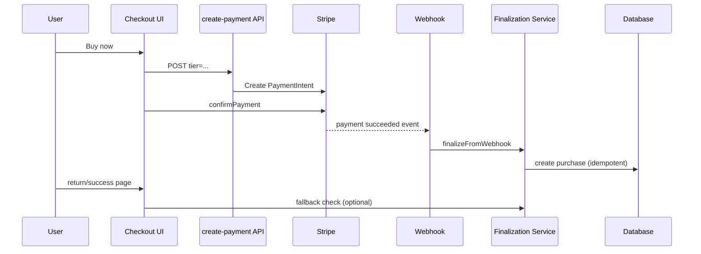
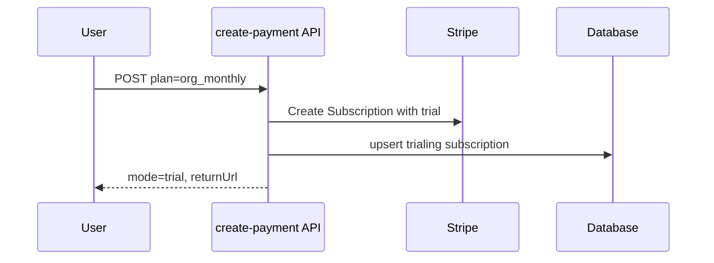
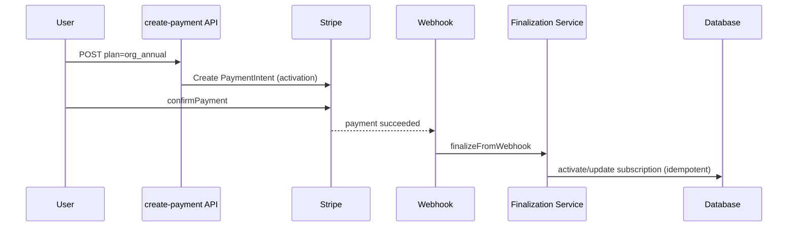
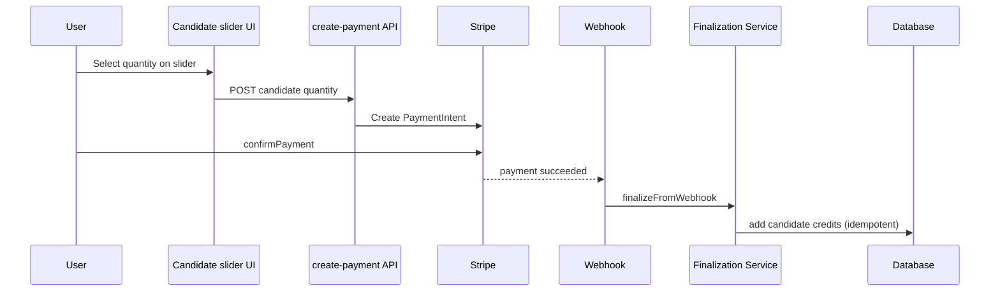

# I2 — Billing Remediation Task List + Folyamatábrák

> Dátum: 2026-04-08  
> Input döntések: webhook-first truth, fallback megtartása, candidate slider, one-time webhook finalizáció, legacy API-k kivezetése

---

## 1) Rögzített döntések (source of truth)

1. **Webhook-first truth**: minden fizetési domain truth elsődlegesen Stripe webhookból íródik.
2. **Fallback kell**: ha webhook késik vagy kimarad, legyen biztonsági finalizációs fallback.
3. **Candidate addon UX**: fix 1/5/10 helyett mennyiségi slider.
4. **One-time purchase finalizáció**: webhookban történjen, return/success csak fallback legyen.
5. **Legacy embedded checkout API-k**: fokozatosan, de teljesen kivezetjük.

---

## 2) Konkrét task lista (végrehajtási sorrend)

## P0 — Stabilizációs hotfixek

### T1. Return flow rövidzár javítás
- Scope:
  - `src/app/billing/return/page.tsx`
  - `src/lib/billing/return-resolution.ts`
- Feladat:
  - `payment_intent` ág értékelése a redirect előtt.
  - `session_id` nélküli return ne dobja el automatikusan a PI-flow-t.
- Acceptance:
  - subscription activation PI és candidate PI nem vész el return oldalon.

### T2. Hibás checkout paraméterek javítása
- Scope:
  - `src/app/hiring/[orgId]/_components/HiringPaywall.tsx`
  - `src/components/pricing/TeamTierPanel.tsx`
- Feladat:
  - `candidate_addon` link megszüntetése.
  - `team_snapshot` helyes paraméterezése (`tier`, ne `plan`).
- Acceptance:
  - checkout init nem ad `INVALID_INPUT`-ot ezeken a belépési pontokon.

### T3. Checkout input normalizáló helper
- Scope:
  - új helper: `src/lib/billing/checkout-intent.ts` (javasolt)
  - `EmbeddedCheckoutClient` és checkout entrypointok
- Feladat:
  - egységesen map-eljük a query/UI inputot backend contractra.
- Acceptance:
  - nincs szétszórt `tier/plan/candidatePack` kézi map több helyen.

---

## P1 — Webhook-first finalizáció bevezetése

### T4. Központi finalizációs service létrehozása
- Scope:
  - új service: `src/lib/billing/finalization-service.ts` (javasolt)
- Interface javaslat:
  - `finalizeFromWebhook(event)`
  - `finalizeFromFallback({ paymentIntentId?, sessionId?, source })`
- Feladat:
  - one-time purchase, subscription activation, candidate credit ugyanabba az idempotens domain pathba kerüljön.
- Acceptance:
  - webhook és fallback ugyanazt a finalizációs kódot használja.

### T5. One-time purchase webhookra átkötése
- Scope:
  - `src/lib/billing/handlers/checkout-completed.ts`
  - `src/app/billing/success/page.tsx`
- Feladat:
  - `success` page ne üzleti truthot írjon elsődlegesen, csak fallback trigger és UX.
- Acceptance:
  - purchase létrehozás elsődlegesen webhookban történik.

### T6. Candidate addon webhook-first + fallback
- Scope:
  - webhook handler + return fallback
- Feladat:
  - credit jóváírás webhookból.
  - fallback csak idempotens safety-net.
- Acceptance:
  - duplikált jóváírás nem történik; webhook kimaradás esetén fallback pótol.

### T7. Subscription activation webhook-first + fallback
- Scope:
  - webhook subscription sync + return fallback
- Feladat:
  - PI-s activation után a subscription létrehozás és státuszfrissítés webhook-first.
  - return fallback újrahasznosítja a finalization service-t.
- Acceptance:
  - trial utáni aktiváció megbízható webhook esetén; fallbackkel is lezárható.

---

## P2 — UX és API cleanup

### T8. Candidate addon slider UX
- Scope:
  - `OrgProductCards` és releváns checkout UI
- Feladat:
  - mennyiségi slider + árképzés kalkuláció backenddel összehangolva.
- Acceptance:
  - admin tetszőleges (policy által engedett) mennyiséget tud választani; checkout stabil.

### T9. Legacy API deprecate + kivezetés
- Scope:
  - `src/app/api/billing/checkout/route.ts`
  - `src/app/api/billing/purchase/route.ts`
- Fázisok:
  1. deprecate warning + usage mérés
  2. hívók átvezetése új flow-ra
  3. route törlés
- Acceptance:
  - nincs aktív hívó legacy route-okra.

### T10. Billing health endpoint bővítése
- Scope:
  - `src/app/api/billing/health/route.ts`
- Feladat:
  - minden releváns env/key és stratégiai config check.
- Acceptance:
  - hiányzó config gyorsan diagnosztizálható.

---

## P3 — Observability és tesztek

### T11. Billing trace standard
- Scope:
  - billing routes + handlers + finalization service
- Kötelező mezők:
  - `entryPoint`, `productType`, `stripeObjectType`, `finalizationPath`, `outcome`, `idempotencyKey`
- Acceptance:
  - egy hibás fizetés útja rekonstruálható end-to-end.

### T12. Regressziótesztek
- Minimum:
  - webhook success path (one-time/subscription/candidate)
  - webhook missing -> fallback success
  - duplikált event/idempotencia
  - hibás input paraméterek
- Acceptance:
  - kritikus billing döntések automatizáltan védettek.

---

## 3) Folyamatábra — cél architektúra (webhook-first + fallback)

```mermaid
flowchart TD
    A[User checkout entrypoint] --> B[Checkout Intent Normalizer]
    B --> C[/api/billing/create-payment]
    C --> D[Stripe PI / Subscription creation]
    D --> E[Client confirmPayment]
    E --> F{Stripe webhook megérkezik?}

    F -->|Igen| G[Webhook handler]
    G --> H[Finalization Service finalizeFromWebhook]
    H --> I[(DB truth update)]
    I --> J[UI return/success page read-only state]

    F -->|Nem / késik| K[Return or Success fallback trigger]
    K --> L[Finalization Service finalizeFromFallback]
    L --> M{Már finalizált?}
    M -->|Igen| J
    M -->|Nem| I
```

---

## 4) Szcenárió ábrák

## S1 — One-time purchase (`self_plus`, `team_snapshot`, `team_deep_dive`)



## S2 — Subscription (trial first-time)



## S3 — Subscription activation (trial után, PI)



## S4 — Candidate addon slider purchase



---

## 5) Ajánlott végrehajtási terv (2 sprint)

### Sprint 1
- T1, T2, T3, T4
- T5 (one-time webhook-first alap)

### Sprint 2
- T6, T7, T8
- T9 (legacy kivezetés)
- T10, T11, T12

---

## 6) Exit criteria

1. Nincs olyan kritikus fizetési ág, ami csak return/success oldalon finalizál.
2. Webhook kimaradás esetén is idempotens fallback zárja a folyamatot.
3. Candidate addon slider éles, stabil és policy-kompatibilis.
4. Legacy checkout/purchase API-k teljesen kivezetve.
5. Billing flow döntések trace-elhetők és regresszióteszttel védettek.

