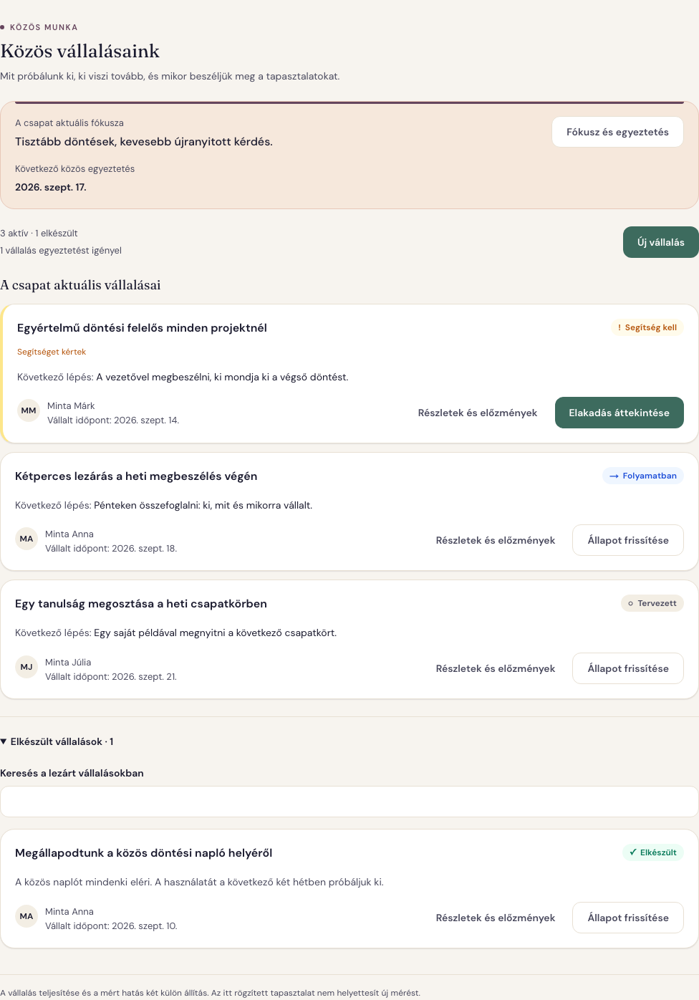
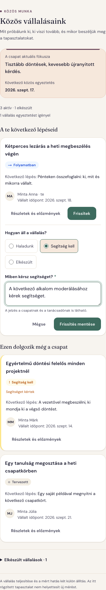

# Közös vállalásaink — megvalósítás

A tanácsadó, a vezető és a csapat ugyanazokat az élő vállalásokat követi. A tanácsadó az egyeztetést igénylő tételeket látja először; a csapattag a saját következő lépését és egy rövid frissítési lehetőséget. A felület a jóváhagyott koncepció alapján készült.

| Korábbi folyamat | Elkészült működés |
| --- | --- |
| A riport javaslatlistája egyben élő akciókövető | Önálló **Vállalások** fül, riportból és workshopból is elérhető |
| A felelős szabad szöveges név | Csapattaghoz kapcsolt felelős, jogosultsággal ellenőrzött saját frissítés |
| Hosszabb, teljes listát érintő módosítás | Egy vállalás mentése: **Haladunk / Segítség kell / Elkészült** |
| Új riporthoz kötött követés | Megmaradó vállalások, jelzések és előzmények új riport után is |
| A közös egyeztetés és a vállalás dátuma összemosódhat | Külön csapatfókusz, egyeztetési időpont és vállalt időpont |

## Tanácsadói és vezetői áttekintés

A fókusz és a következő egyeztetés közös keretet ad. Az elakadt vállalás előresorolódik; a kártya megmutatja a következő lépést, felelőst és időpontot. A lezárt vállalások visszakereshetők.

## Csapattagi frissítés mobilon

A saját vállalás kerül előre. A segítségkéréshez rövid jelzés szükséges, és világosan látszik, hogy azt a csapat és a tanácsadó is olvashatja. A többi csapattag vállalásai követhetők.

## Ellenőrzés

- `pnpm check`, `pnpm build`: sikeres.
- Teljes unit: **1322/1322**; kliens: **459/459**, 80 fájl; PostgreSQL integráció: **227/227** (review utáni futás).
- Új valós böngészős regresszió: **2/2**. Mobilos csapattagi mentés, tanácsadói visszaolvasás, újratöltés, másik tag tiltott módosítása és angol navigáció.
- Kilenc képernyőállapot: üres nézet, létrehozás, tanácsadói lista, csapattagi frissítés és előzmények, 320 px/200% szöveg, angol sötét téma, üres mobilnézet és csak olvasható vezetői hozzáférés. A vizsgált állapotokban nincs oldalszintű vízszintes túlcsordulás vagy kliensoldali kivétel.
- Célzott axe WCAG A/AA vizsgálat: **0 automatikusan igazolt hiba** az új munkafelületen. A `color-contrast` egyes összetett szövegeknél kézi ellenőrzést kér; ez nem teljes akadálymentességi tanúsítás.
- Quality Gate, UI Surface és szigorú UI Audit Guardrail: sikeres. Új nyers hex: **0**. [Kötelező audit-összefoglaló](ui-audit-summary.md).

A képek a működő fejlesztői alkalmazásból készültek, mesterséges nevekkel és vállalásokkal. A tesztek helyi, izolált adatbázisokat használtak. Az ideiglenes képi fixture-ök a futás végén törlődtek.

## Kiadási feltétel

A kód kiadása előtt alkalmazandó a `20260911080000_add_team_commitments`, `20260911120000_add_commitment_plan_events` és a review után hozzáadott `20260911160000_nullable_commitment_identity` additív migráció. Éles adatbázison ez nem történt meg. Nincs automatikus riportimport vagy emlékeztető-küldés. A fókusz és egyeztetés verziói adatbázisban naplózottak; a felületen a vállalások előzményei láthatók.

A későbbi review a kilépett felelős melletti szerkesztést, az aktuális megjegyzés ürítését és a fióktörlés strukturált hivatkozásait is javítja. [Review utáni változások és tudatos termékdöntések](../changelog/2026-09-11-commitments-review.md).

[Használat és adatmodell](../../product/team-commitments.md) · [Változásnapló](../changelog/2026-09-11-team-commitments.md)
