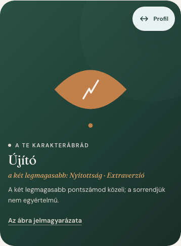
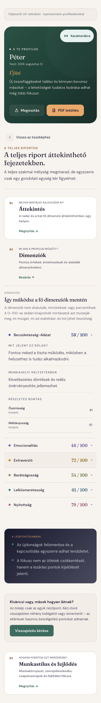

# Egyéni és csapatélmény — megvalósított auditfeladatok

A javítások közös, a `main` ágból indított `codex/ui-ux-persona-improvements` ágon készültek. Három ügynök dolgozott az egyéni élményen, a csapatriportokon és a hozzáférésen; a koordinátor integrálta a közös UI-elemeket és feladatonként commitolt. A közös szerződés: meglévő jogosultsági segédek, HU/EN szövegek, szemantikus színek, közös gombok és szekciócímkék, valamint következetes mért/becsült jelölés.

## A 15 feladat eredménye

| # | Megvalósítás | Ellenőrzés |
| --- | --- | --- |
| 1 | A vezetői cockpit már a lekérdezésben kizárja a jogosulatlan nyers személyiség- és kapcsolati adatokat. Fagyasztott állapotban csak összesített létszámok jelennek meg. | Lekérdezésalakot és engedélyezett adatokat vizsgáló unit tesztek; aktív, korlátozott és fagyasztott helyi szervezet. |
| 2 | A régi publikált riportok dimenziókulcsai olvasáskor normalizálódnak. Hiányos adatokból nem készül üres radar; eltűnik az „Ismeretlen minta” helykitöltő és a már kitöltött saját teszt téves újrakezdő CTA-ja. | Régi és részleges pillanatképek tesztjei; élő demóriport mobilon és asztali nézetben. |
| 3 | Közös készültségi sorrend: önértékelések → visszajelzések → értelmezés → publikált riport. A kitöltöttség önmagában nem jelent jóváhagyást; korábbi publikáció mellett az aktuális kör állapota külön értelmezhető. | Állapotmátrix és tagi pillanatkép tesztek. |
| 4 | A karakterábra az első–második vagy második–harmadik hely közelségét a megfelelő dimenziókkal magyarázza. | Célzott sorrend- és megjelenítési tesztek. |
| 5 | Fejlődési javaslat hiányában megtehető viselkedési lépés vagy egyhetes kísérlet jelenik meg. | A dimenziódefiníciót kizáró és alacsony pontszám nélküli profilokat ellenőrző tesztek. |
| 6 | A profilfejléc magassága a tartalmat követi; hosszú nevek és 200%-os szöveg sem vágnak le tartalmat. | Magyar/angol, 320/390/1440 px, 100/200%; valós demoperszónák hosszú nevekkel. |
| 7 | A csapatkezelő gombok, szervezeti csapatlinkek és riportműveletek ugyanazokat a jogosultságokat követik, mint a szerver. | UI- és API-tesztek tiltott meghívó-, riport- és akcióműveletekre. |
| 8 | A személyes oldalon korán elérhető a részletes eredmény, majd három felismerés és egy következő lépés következik. A páros összevetés később kap helyet. | Sorrendi és navigációs kliensellenőrzések, 48 perszóna mobilképei. |
| 9 | A csapatprioritások és a jóváhagyott riport felismerései előre kerültek; a készültség összecsukható, a részletes bizonyítékok fejezetenként elérhetők. A publikált tanácsadói riport olvasással indul. | Fejezetcélok, tag/admin/tanácsadó nézetek, riport olvasó- és szerkesztőállapotai. |
| 10 | Egy aktív fő navigációs cél; saját eredmények minden szerepkörből. A Vissza/Előre és a fejléc-link együtt tartja az URL-t és a megnyitott fejezetet. | Navigációs unit tesztek és 14 állapotú böngészős visszajátszás. |
| 11 | A külső visszajelzés szövege megkülönbözteti a tanácsadó indítását, a saját értékelőválasztást, a kolléga belépését és a külső értékelő azonos böngészőben folytatható piszkozatát. | HU/EN kliensellenőrzések és az observer belépési szabályok felülvizsgálata. |
| 12 | A mobil segítség a fejlécből nyílik, nem takarja a tartalmat. Javultak az érintési célok, a halvány szövegek és a csapatábrák feliratainak kontrasztjai. | Segítség/fókusz tesztek, automatizált kontrasztmérés és képi ellenőrzés. |
| 13 | Közös szekciócímkék, gombok és billentyűzettel kezelhető szervezeti fülek; lokalizált szerepkörök. A vizsgált csapatnézetből eltűnt a kevert „assessment”, „Observer kör”, „deep-dive tulajdonos” szóhasználat. | Típus- és lintellenőrzés, roving-tabindex teszt, böngészős szövegellenőrzés. |
| 14 | A személyiségeltérés semleges tónusú; a kapcsolati ábra nevei megkülönböztethetők és billentyűzettel választhatók. A mért, becsült és vegyes forrás a kapcsolódó állítás mellett látható. | Névütközések, mért/vegyes/becsült kapcsolatok és billentyűzetes kiválasztás tesztjei. |
| 15 | Nagyobb karakterábra, feliratos mobil váltógomb, rövidebb magyarázat, nyitható jelmagyarázat, egyszerűbb részletkártyák és kompakt alkalmazáslábléc. | A gomb feliratát és ikonját is mérő 24 böngészős eset; mobil/nagyított lábléc és megjelenésválasztó. |

## Képi példa

Az alábbi képek a repóban szereplő, mesterséges „Péter” fejlesztői profilról készültek; nem felhasználói fiókból származnak.

| Jól olvasható karakterábra és váltás | Egyetlen nyitott részletes fejezet |
| --- | --- |
|  |  |

## Validáció és korlátok

A böngészős ellenőrzés elkülönített helyi PostgreSQL-klónt és rövid életű Clerk tesztmunkameneteket használt. Éles adatbázis-módosítás, meghívó- vagy e-mail-küldés nem történt. A 48 perszóna képei és a szerepkörös ellenőrzés részletes leletei helyi auditkimenetként maradtak meg; fiókadatokat nem tettünk a nyilvános PR-ba.

- `pnpm check`: típusellenőrzés, ESLint és szemantikus színellenőrzés sikeres.
- `pnpm build`: sikeres production build és 114 előrenderelt oldal.
- `pnpm test:unit`: **1318 / 1318** sikeres teszt.
- `pnpm test:client`: **386 / 386** sikeres teszt, 77 tesztfájl.
- Böngésző a production builden: **48 / 48 perszóna és 17 / 17 csapat/szerepkör/előfizetési eset sikeres**, a perszónák futása közben nincs kliensoldali kivétel. További ellenőrzés: 14 navigációs állapot, célzott HU/EN és 200%-os újratördelési esetek.
- Az automatizált axe-vizsgálat az egyéni összkép, a dimenziófejezet és a tanácsadói csapatintelligencia világos nézetén, valamint az összkép és csapatintelligencia sötét nézetén **0 igazolt WCAG A/AA hibát** jelzett a javítás után. A szerepkártyák és hálózati monogramok minimum kontrasztja világos témában 5,53:1, sötét témában 5,29:1. Ez célzott gépi ellenőrzés, nem teljes akadálymentességi tanúsítás.

### UI audit summary artifact

`pnpm audit:ui`, scope: `src/app`, `src/components`, 577 fájl. A repository-szintű számlálók meglévő technikai adósságot is tartalmaznak:

| Metrika | Érték |
| --- | ---: |
| Új nyers hex szín a `main…HEAD` diff hozzáadott soraiban | 0 |
| Arbitrary Tailwind nettó változás a mainhez képest | −42 |
| Meglévő nyers hex előfordulás | 334 / 13 fájl |
| Arbitrary Tailwind előfordulás | 2572 / 235 fájl |
| Ismétlődő stílusreceptek redundáns előfordulása | 727 |
| Explicit `min-h-[44px]` előfordulás | 233 |

A 44 px-es közös gombok és a `min-h-11` célok nem mind szerepelnek az utolsó, szövegminta-alapú számlálóban. A branch nem állítja, hogy a teljes alkalmazás vizuális adósságát megszüntette.

A Quality Gate és az UI Audit Guardrail helyben, a `main…HEAD` tartományon is sikeres. A vizsgálat nem helyettesít teljes képernyőolvasós vagy valódi eszközös elfogadási tesztet.
