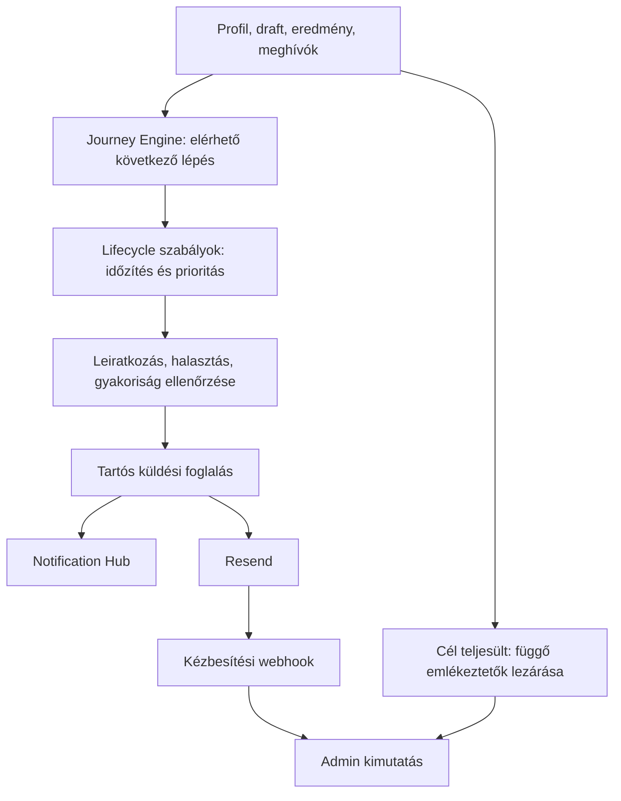

# Profilok folytatását segítő értesítési motor

Státusz: eredeti fejlesztési javaslat. Dátum: 2026-09-26.

Az első változat tényleges működését és bevezetését a `docs/development/profile-followup-rollout.md` írja le.

A vizsgálat alapja a helyi kódbázis, `3afbc122b39346fb9c784510d4ba71dc15f950fd` commit. Az alábbi ütemezések és limitek javasolt induló beállítások. A dokumentum önmagában nem igazolja a production cronok futását vagy a levelek kézbesítését.

## 1. Javaslat

A meglévő Journey Engine és Notification Hub mellé kerüljön egy `lifecycle` modul. A Journey Engine mondja meg, milyen következő lépés érhető el a felhasználónak; az új modul azt, hogy mikor érdemes erre emlékeztetni, melyik csatornán, és mikor kell abbahagyni.

Az első változat három helyzetet kezeljen:

1. Regisztrált, az alapbeállításokkal elkészült, de még nem kezdte el az önértékelést.
2. Elmentett válaszai vannak, de az önértékelést félbehagyta.
3. Elkészült az önértékelése, és még nem kért külső visszajelzést.

A harmadik helyzetnél a személyes eredmény már teljes értékű. Az üzenet azt mutassa meg, mire jó az önkép és mások tapasztalatának összevetése. A megfogalmazás legyen választható ajánlat. A szervezet által vezetett mérésben a külső visszajelzés időzítését továbbra is a kampány határozza meg.

## 2. Mi van már a rendszerben?

| Terület | Meglévő működés a kódban | Felhasználás |
|---|---|---|
| Journey Engine | Állapot, elérhető műveletek, következő lépés, szerep- és hozzáférési korlátok | A célművelet központi forrása |
| Notification Hub | Alkalmazáson belüli értesítés, olvasás/elrejtés, egyedi kulcs | Ugyanaz a feladat megjelenhet az értesítésekben |
| Félbehagyott önértékelés | Adminból kézzel küldhető emlékeztető; számláló és utolsó küldési idő | Átkötendő a közös küldési szabályokra |
| Külső értékelő emlékeztetése | Függő meghívó esetén legalább 4 nap után, majd legalább 5 nappal később; automatikusan legfeljebb kétszer | A meghívott kapja; a profil tulajdonosának ösztönzésével összehangolandó |
| Reflexiós levél | Az önértékelés után 7–10 napos ablakban, életciklus-leiratkozás figyelembevételével | Bevonandó a közös gyakorisági korlátba |
| Levélbeállítások | `UserProfile.lifecycleEmailsOptOut`, külön hírlevél-beállítások | Az új levelek ezt az életciklus-beállítást használják |
| Resend és hírlevélküldés | Részletes küldési eredmény, idempotenciakulcs, tartós foglalás, kézbesítési webhook | A közös technikai elemek újrahasznosíthatók |

Források: [Journey Engine](/Users/leinadoknilik/trita/codebase/src/lib/journey/engine-core.ts), [következő lépés](/Users/leinadoknilik/trita/codebase/src/lib/journey/next-best-action.ts), [napi értesítési kör](/Users/leinadoknilik/trita/codebase/src/lib/notifications/sweep.ts), [kézi draftemlékeztető](/Users/leinadoknilik/trita/codebase/src/app/api/admin/send-draft-reminder/[id]/route.ts), [levélbeállítások](/Users/leinadoknilik/trita/codebase/src/app/api/profile/email-preferences/route.ts), [hírlevél kézbesítési naplója](/Users/leinadoknilik/trita/codebase/src/lib/newsletter.ts).

### Amit az automatizálás részeként rendezni kell

- **Egységes leiratkozás és korlátok:** a kézi draftemlékeztető végpont jelenleg nem ellenőrzi a `lifecycleEmailsOptOut` mezőt, a törölt profilt vagy a címzett várakozási idejét. Az admin saját kéréseinek korlátozása ezt nem helyettesíti.
- **Küldésenkénti napló:** a reflexiós levél az alkalmazáson belüli értesítéshez köti az ismétlés megakadályozását. Sikertelen email után ezért nem próbálkozik újra. A két csatorna kézbesítési állapota külön kezelendő.
- **Párhuzamos küldések:** a külső értékelő emlékeztetője küldés után növeli a számlálót. Párhuzamos kézi és automatikus futás, illetve az utólagos adatbázis-módosítás hibája ismételt levelet okozhat.
- **Mérési kör:** a kézi draftemlékeztető bármilyen korábbi eredményt kizáró oknak vesz, miközben a draftnak `self` vagy `campaign:<id>` hatóköre van. A céloldal is általános `/assessment`. A szabály és a link ugyanahhoz a mérési körhöz tartozzon.
- **Kézbesítési visszajelzés:** a Resend webhook jelenleg a hírlevél kézbesítési és feliratkozói tábláit frissíti. Az életciklus-levelekhez is kell kézbesítési állapot és a hibás/panaszt jelző címek közös kizárása.

## 3. Induló szabályok és felhasználói élmény

| Szabály | Első levél legkorábban | Egyetlen további emlékeztető | Leállítás / cél |
|---|---|---|---|
| `START_SELF` | Az onboarding befejezése után 48 órával; nincs draft vagy személyes eredmény | A 7. naptól | Draft létrejön, eredmény elkészül, vagy a felhasználó kihagyja |
| `RESUME_SELF` | A személyes draft utolsó érdemi változásától 24 órával | A változástól számított 4. naptól, az első levél után legalább 72 órával | Friss kitöltés halasztja; beadás lezárja |
| `INVITE_FIRST_OBSERVERS` | A személyes eredmény és onboarding közül a későbbi után 72 órával; még nincs személyes meghívó vagy külső eredmény | A 10. naptól | Az első meghívó vagy visszajelzés lezárja; „Most kihagyom” letiltja erre a célra |

A szabály akkor alkalmazható, ha az adott művelet a Journey Engine szerint is elérhető. Az időpontok legkorábbi esedékességek: a napi feldolgozás és a közös küldési korlát későbbre tolhatja a levelet. Az első változatban egy szabály legfeljebb 14 napig maradjon aktív új előrelépés nélkül; késés miatt ne küldjük ki egyszerre az elmaradt leveleket.

**Közös alapértékek:** felhasználónként legalább 72 óra két életciklus-levél között, legfeljebb 3 ilyen levél gördülő 30 nap alatt. Egy célhoz legfeljebb 2 levél tartozik. A küldést már megkísérlő, bizonytalan kimenetelű foglalás is számít a korlátba, amíg az eredménye tisztázatlan. A kézi adminos küldés ugyanezeket a szabályokat követi.

A rendszer egyszerre egy következő lépést ajánljon. A félbehagyott önértékelés befejezése elsőbbséget kap; utána következhet a külső visszajelzés. A meglévő reflexiós ajánlat alacsonyabb prioritású, és csak a saját időablakán belül küldhető. A belépési kódok és a kért meghívók saját működésük szerint mennek. A külső értékelők emlékeztetőihez külön, címzettenkénti korlát szükséges, mert egy ember több meghívót is kaphat.

### Példa a külső visszajelzés ajánlására

**Tárgy:** Mit látnak belőled azok, akikkel együtt dolgozol?

> Elkészült a saját trita-eredményed. Ha szeretnéd, most kollégáktól is kérhetsz visszajelzést, és összevetheted a saját képedet az ő tapasztalataikkal. Válassz olyanokat, akik ismerik a mindennapi munkádat.
>
> **Visszajelzést kérek**

A gomb a meglévő `/profile/results?tab=comparison#invitations` felületre vezessen. Ott legyen egy rövid magyarázat, meghívó-előnézet, és egyértelmű beérkezési állapot. A minimális válaszadószámot a központi anonimitási szabályból kell venni; jelenleg 3. Az értékelők meghívását továbbra is a felhasználó indítsa el.

A félbehagyott kérdőív levele mondja el, hogy a mentett válaszok megvannak, és a megfelelő draftra vigyen. Kitöltött darabszám csak az adott kérdőív érvényes kérdéseiből számolható. A sablonok magyarul és angolul készüljenek; személyiségpontszám és nyers válasz nem szükséges a levélhez.

Az eredményoldali ajánlat használja a már meglévő következő lépés felületét. Kiegészítő műveletek: „Emlékeztess egy hét múlva”, „Most kihagyom”, illetve az emailben életciklus-leiratkozás. Az alkalmazáson belüli feladat lezárását az adatbázisban megvalósult előrelépés is frissítse.

## 4. Beillesztés az architektúrába

### Döntés és adatok

Javasolt hely: `src/lib/lifecycle/`, benne `context.ts`, `rules.ts`, `policy.ts`, `repository.ts`, `service.ts`. A szabályfüggvények bemenete rögzített időpontot is tartalmazzon, így időfüggő esetekkel tesztelhetők. Az időzítések és verziózott sablonok az első változatban kódban konfigurálhatók.

A Journey Engine állapotait és hozzáférési szabályait a lifecycle modul újrahasználja. Ehhez külön időadatok kellenek: onboarding ideje, draft utolsó érdemi módosítása, személyes eredmény ideje, releváns meghívók és beérkezések, korábbi küldések, halasztás. A jelenlegi journey kontextus több helyen csak azonosítót vagy darabszámot olvas.

A napi kiválasztás először olcsó, indexelt lekérdezésekkel szűkítse a lehetséges címzetteket. Csak erre a korlátozott csoportra kérje le a teljes journey döntést. A teljes felhasználói táblán egyenként lefuttatott, sok lekérdezést végző journey-feloldás feleslegesen terhelné az adatbázist. Később a központi kontextusgyűjtő kötegelt változata készülhet, változatlan döntési logikával.

**Az aktivitás mérésének határai:**

- A `UserProfile.updatedAt` nem aktivitási időbélyeg; háttérmódosítás is átírja.
- A draft `updatedAt` azonos válaszok ismételt mentésekor is változhat. Az első változat ezt konzervatív halasztásként kezelheti; pontosabb időzítéshez `lastProgressAt` szükséges, amely tényleges válaszváltozáskor frissül.
- A vendégként félbehagyott, csak böngészőben mentett kérdőívhez nem áll rendelkezésre szerveroldali címzett. Ez kívül esik az első változaton.
- A Vercel látogatottság és a kliensesemények hiánya nem bizonyítja, hogy valaki nem járt egy oldalon. A kiválasztás alapja a mentett termékállapot legyen. „Még nem nézte meg az eredményét” típusú szabályhoz külön, megbízható megtekintési jel kellene.

### Javasolt tartós nyilvántartás

| Elem | Feladat és fontos adatok |
|---|---|
| `LifecycleOpportunity` | Egy követhető cél: profil, szabály, mérési kör, célazonosító, következő esedékesség, lejárat, halasztás, lezárás oka/ideje, szabályverzió |
| `LifecycleDelivery` | Egy logikai üzenet: cél, sorszám, csatorna, foglalás ideje/lejárata és tulajdonosa, állapot, stabil idempotenciakulcs, sablonverzió, címzett, rögzített minimális payload, provider ID, próbálkozások és hibakódok |
| `EmailSuppression` | Normalizált címhez tartozó végleges kézbesítési hiba vagy panasz, forrás és időpont; hírlevél-tagságtól függetlenül |

Egyedi célkulcs: `(profileId, ruleId, scope, goalKey)`. Egyedi küldéskulcs: `(opportunityId, sequence, channel)`; a `providerEmailId` is egyedi, ha már ismert. A sablonverzió módosítása nem hoz létre új küldési jogosultságot. Index szükséges az állapot/esedékesség és a címzett/küldési idő szerinti lekérdezésekhez.

A kezdés és első külső meghívás célja személyes körben egyszeri. Egy új önértékelési eredmény önmagában ne indítsa újra a meghívásra ösztönzést. Draftnál a mérési kör és a draft azonosítja a célt; új mentés halaszt, de nem nullázza a kiküldött levelek számát. Későbbi kampányok külön célazonosítót kapjanak.

A meglévő `Notification` táblát az orchestratoron keresztül használjuk, saját egyedi kulccsal. Az email kézbesítési állapota külön marad. A hírlevélhez kötött `NewsletterDelivery` sémába nem illik a fiókhoz és termékállapothoz tartozó utánkövetés; a foglalási és Resend-kezelési elemekből közös technikai modul emelhető ki.

### Küldési protokoll

1. Szabályok kiértékelése és a nyitott célok egyeztetése a friss termékállapottal.
2. Rövid adatbázis-tranzakcióban a címzett gyakorisági keretének ellenőrzése és a küldési foglalás létrehozása. A zárolás címzettenként működjön, hogy különböző szabályok se tudják egyszerre túllépni a keretet.
3. Közvetlenül a küldés előtt újraellenőrzés: cél továbbra is aktuális, nincs leiratkozás, törlés, címváltozás vagy hozzáférési akadály. Megváltozott helyzetben lezárás/halasztás. A hálózati hívás az adatbázis-tranzakción kívül fusson.
4. Resend-hívás stabil kulccsal és az adott küldéshez rögzített tartalommal. `ACCEPTED` a szolgáltató átvételét jelenti; `DELIVERED` csak kézbesítési eseményből következik.
5. Biztos hiba esetén korlátozott újrapróbálás; időtúllépés vagy félbeszakadt küldés esetén `UNKNOWN`, egyeztetés és óvatos újrapróbálás. A lejárt foglalás önmagában nem bizonyítja, hogy nem ment ki a levél.
6. A webhook kezelje az ismételt és eltérő sorrendben érkező eseményeket is. A gyorsan beérkező, még provider ID-hoz nem kapcsolható eseményt tartósan meg kell őrizni és később egyeztetni. Ehhez eseménynapló/inbox is szükséges. A késői elfogadási válasz nem írhat felül kézbesítési vagy panaszállapotot.

A Resend idempotenciakulcsa jelenleg **24 óráig** él. Ezen belül ugyanazt a kulcsot és tartalmat kell újrahasználni. A következő napi cron már túl lehet ezen az ablakon: bizonytalan korábbi küldést ilyenkor automatikusan újraküldeni nem biztonságos. A helyi napló és a provider-visszajelzés együtt szükséges. [Resend: idempotency keys](https://resend.com/docs/dashboard/emails/idempotency-keys).

### Ütemezés

Javaslat: külön `/api/cron/lifecycle` napi végpont a meglévő cron-hitelesítés mintájára, induláskor legfeljebb 50 küldési jelölttel és végrehajtási időkerettel. Így a kampánylépések megnyitásától függetlenül futtatható és felügyelhető. Egy kimaradt nap után a még aktuális, lejáraton belüli feladatokat pótolja. A torlódás mértéke és a legrégebbi esedékesség jelenjen meg az adminban.

A Vercel jelenlegi dokumentációja szerint Hobby csomagon projektenként 100 cron megengedett, egy adott feladat legfeljebb napi gyakorisággal; a futás a beállított órán belül csúszhat. A forráskódban szereplő „Hobby: 1 cron” megjegyzés ezért elavult. A pontos helyi órára küldéshez vagy sűrűbb feldolgozáshoz később más ütemezés kell. [Vercel: cron limitek](https://vercel.com/docs/cron-jobs/usage-and-pricing).

A Vercel nem ismétli automatikusan a hibás cronfutást, és ritkán kimaradt vagy kettős meghívás is előfordulhat. Kell tartós futási összesítő, hibajelzés és riasztás az elmaradt sikeres feldolgozásra. Az adatbázisos foglalás minden belépési pontnál kötelező. [Vercel: cron hibakezelés](https://vercel.com/docs/cron-jobs/manage-cron-jobs).

## 5. Kizárások, beállítások, visszatérés

- Az első automatikus kör személyes, regisztrált felhasználókra vonatkozzon. A tanácsadói/admin fiókok, tesztadatok, törölt profilok, tudatosan kihagyott önértékelések és aktív szervezeti folyamatok külön kezelendők.
- Szervezet által vezetett módban a külső meghívás a kampányhoz igazodjon. Jóváhagyásra váró meghívót ne értelmezzünk tétlenségnek. A jogosultságot és a mérési kört küldéskor és a céloldalon is ellenőrizni kell.
- A `lifecycleEmailsOptOut` az adminos küldésnél is érvényesüljön. A hírlevél-feliratkozás ettől különálló. Az új üzenetek célját a levélbeállítások és a felhasználói tájékoztatás szövege is nevezze meg; az alapértelmezett `false` érték önmagában nem dokumentál külön hozzájárulást.
- A lifecycle-leiratkozás emailből, belépés nélkül is elérhető legyen: külön erre jogosító token, emberi megerősítés és megfelelő gépi leiratkozási POST. Egy egyszerű GET-et végző levélellenőrző ne módosítsa a beállítást. A leiratkozás a függő emaileket is állítsa le.
- Hitelesített elsődleges címre küldjünk. A jelenlegi Clerk webhook a cím hitelesítési állapotát nem menti a profilba; ezt a szinkront bővíteni kell, és címváltáskor az új címhez kötni az ellenőrzést.
- A folytatási link őrizze meg a célt bejelentkezés után, de a bejelentkezett felhasználó aktuális jogosultsága döntsön. Már teljesített cél esetén a Journey Engine érvényes következő lépésére vezessen. Válaszadat vagy emailcím ne kerüljön az URL-be.
- A napló minimális adatot őrizzen: szabály, időzítés, küldési és célállapot. A megőrzési és fióktörlési folyamatba az új rekordok is kerüljenek be. Cím szerinti kézbesítési kizárás és felhasználói emailpreferencia külön fogalom maradjon.

## 6. Adminfelület és mérés

A meglévő **Emlékeztetők** adminnézet bővüljön ezekkel:

- Kit választott a motor, melyik mentett állapot és időpont alapján?
- Melyik lépést ajánlaná, mikor esedékes, mi halasztja vagy zárja ki?
- Magyar/angol levélelőnézet, közvetlenül ellenőrizhető céloldal.
- Korábbi küldések: foglalt, átvett, kézbesített, hibás, bizonytalan, letiltott.
- Következő lépés teljesült-e, mikor, és melyik mérési körben?
- Egy felhasználó halasztása, adott cél kihagyása, kézi küldés a közös szabályokon át.

Elsődleges eredménymutatók: befejezett önértékelés, első külső meghívó, később elegendő beérkezett visszajelzés. A konverziót szerveroldali adatokból mérjük, előre rögzített, például 7 napos ablakkal. Az email átvétele, kézbesítése, linkkérés és a tényleges előrelépés külön mutató legyen. A linkkérést levélellenőrző is kiválthatja.

A „levél után megtörtént” eredmény még nem bizonyítja a levél hatását. Elég nagy forgalomnál stabilan kijelölt kontrollcsoporttal érdemes összehasonlítani az előrelépési arányt. Kevés felhasználónál az egyedi esetek és a leiratkozások hasznosabbak, mint a kis mintából számolt százalékok.

## 7. Bevezetés és fejlesztési sorrend

**Első ütem — közös alap és előnézet**

- Szabályok, időadatok, közös küldési korlát, tartós napló és címkizárás.
- A kézi draftküldés és a reflexiós levél átvezetése ugyanarra a szabályozásra. A külső értékelő kézi/automatikus emlékeztetőjének közös foglalása.
- Adminban a három új cél előnézete, küldés nélküli napi kiválasztás.
- Az új és régi küldők közötti átálláskor a meglévő emlékeztetőszámlálók és dátumok átvétele; ugyanahhoz a célhoz egyszerre egy aktív küldő tartozzon.

**Második ütem — korlátozott éles használat**

- HU/EN sablonok, folytatási link, halasztás, leiratkozás, webhook és admin kézbesítési nézet.
- Először kiválasztott belső címzettek, majd kis újfelhasználói kör.
- Konfiguráció: `off / preview / manual / automatic`; központi azonnali kikapcsolás.
- Automatikusan az aktiválás után belépő felhasználók legyenek jogosultak. A régi profilok bevonásához külön, előnézhető kör készüljön, hogy az indulás ne teremtsen egyszerre nagy küldési sort.

**Későbbi bővítések**

Onboarding félbehagyása; lejárt külső meghívók pótlása; kevés beérkezett visszajelzés mellett új személyek meghívása; kampányonkénti tanácsadói beállítások. A jelenlegi meghívó-emlékeztetőket ne duplázza egy új folyamat.

### Elfogadási feltételek

1. A három induló szabály helyesen kezeli a határidőket, állapotváltásokat, kihagyást és mérési kört.
2. Párhuzamos cron és adminos küldés ugyanahhoz az üzenethez egy foglalást hoz létre; külön szabályok együtt sem lépik túl a címzett keretét.
3. Küldés előtt történt leiratkozás, törlés, címváltás vagy célmegvalósulás megállítja a már előkészített levelet.
4. Provider-átvétel utáni timeout, lejárt foglalás, gyors/ismételt webhook és 24 órán túli bizonytalan küldés sem vezet vak újraküldéshez.
5. A hírlevélre fel nem iratkozott címek végleges kézbesítési hibája és panasza is érvényesül.
6. Belépés után a megfelelő folytatás nyílik meg; a már teljesült vagy nem elérhető cél helyett érvényes céloldal jelenik meg.
7. Hibás vagy kimaradt futás látszik; a következő sikeres feldolgozás csak az aktuális feladatokat pótolja.

Az implementáció előtt még ellenőrizendő production adatok: jogosultak összesített száma és kor szerinti megoszlása; aktív cronok és utolsó sikeres futás; `CRON_SECRET` és Resend webhook konfiguráció; feladócím és szolgáltatói küldési keret. Ezek a bevezetés méretét és üzemeltetését határozzák meg.

**Ajánlott első szállítás:** a három személyes szabály adminos előnézete és közös, naplózott kézi küldése. Ugyanezt a kódutat használja majd a kis körben engedélyezett napi automatika.
