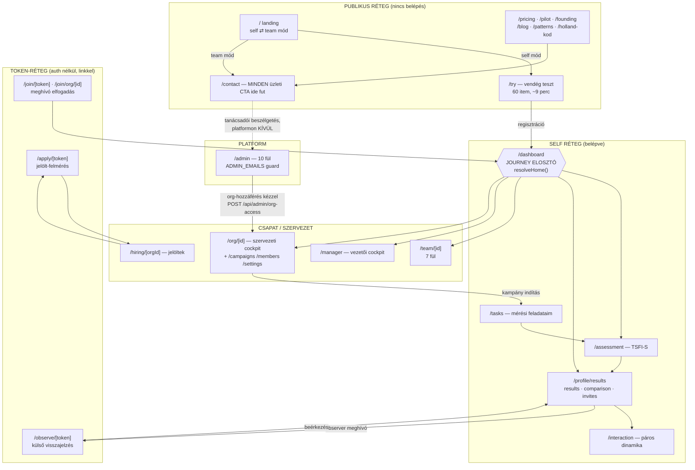
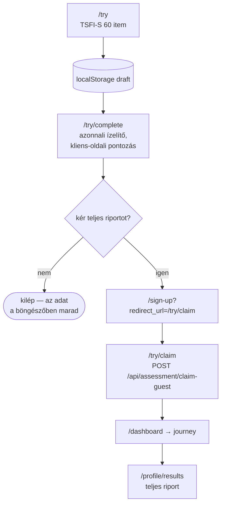
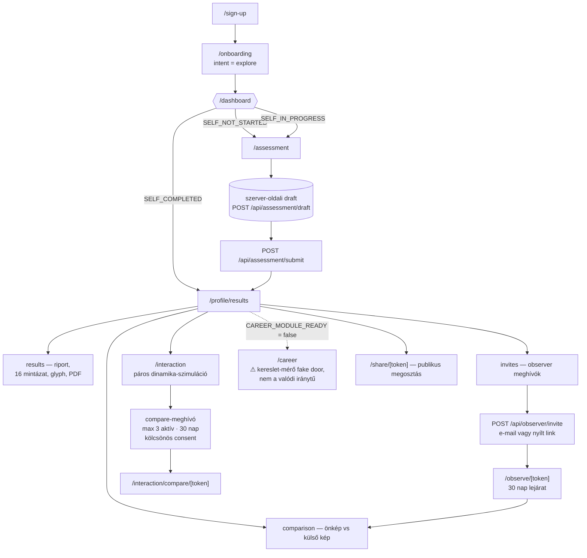
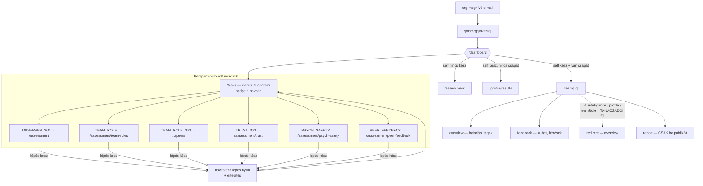
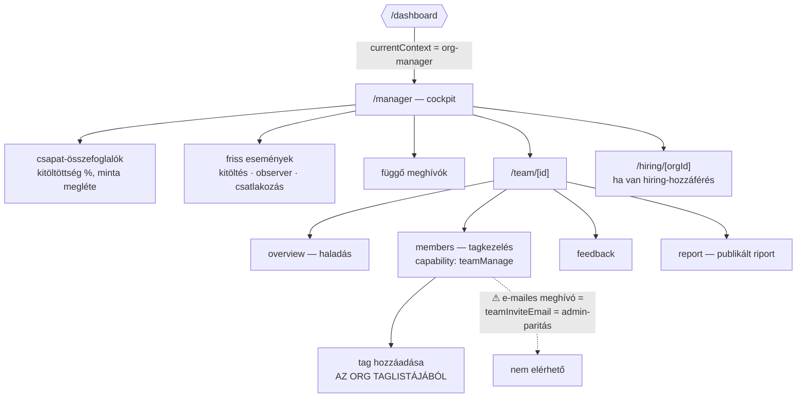
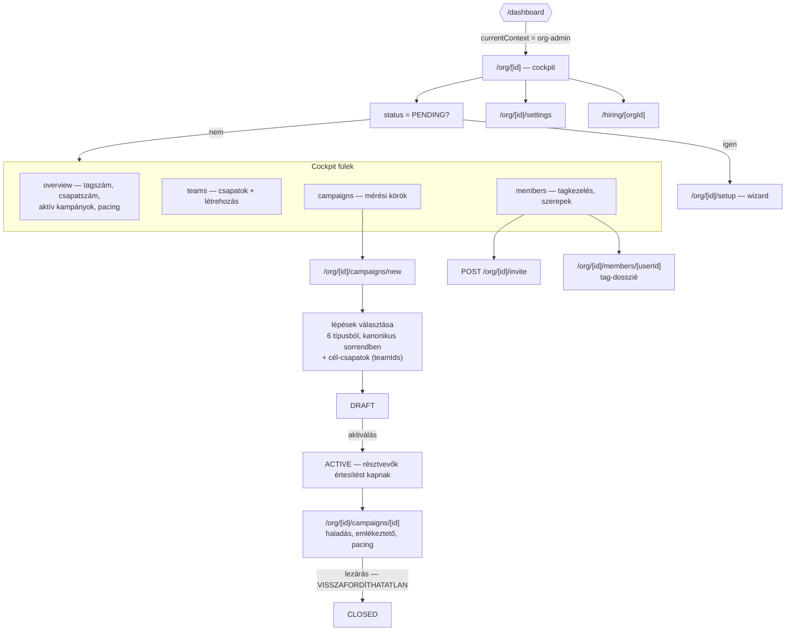
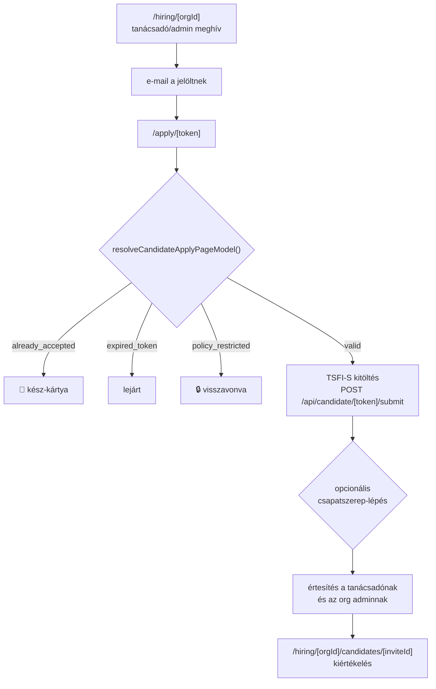
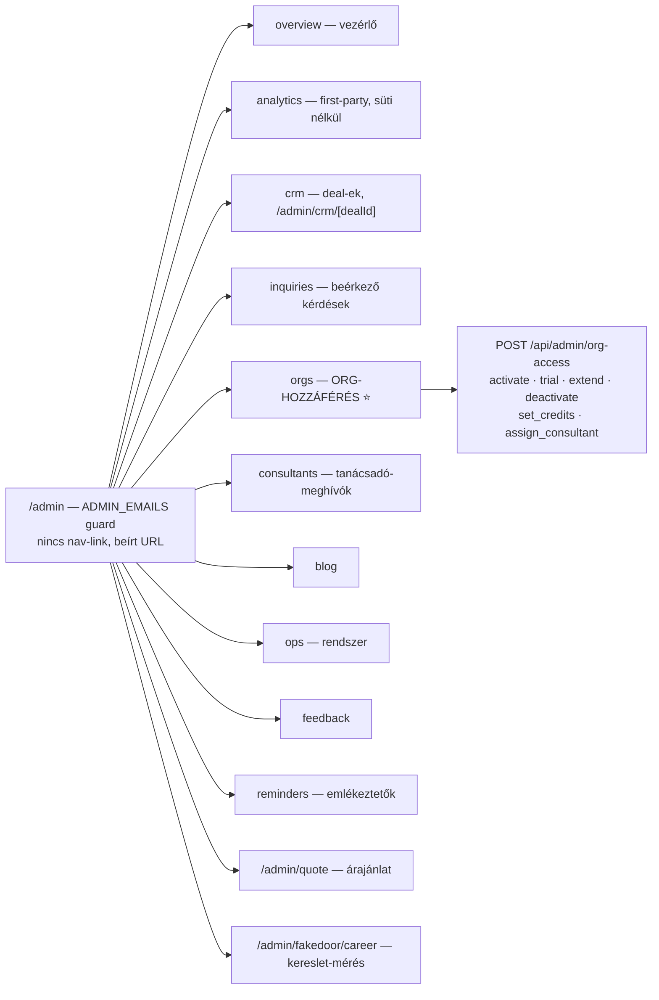

# Trita — Rendszer- és folyamat-áttekintő

> Készült: **2026-08-07**, a `main` állapotáról, kód-szintű átvizsgálással.
> Célja: egy helyen megmutatni, **milyen funkciók élnek ma**, **melyik út
> hova vezet personánként**, és **hol érdemes még csiszolni az indulás előtt**.
>
> Ez a doksi a `docs/architecture/user-journey-map.md` (2026-03-31, a
> consulting-led fordulat ELŐTTI állapot) utódja. Amíg az a fájl él, a két
> leírás ellentmond egymásnak — ld. a *Csiszolás* fejezet C7 tételét.

---

## 0. Hogyan olvasd

A rendszer öt rétegben gondolkodik, és minden persona pontosan egy rétegben
„lakik" — de az utak átvezetnek a rétegek között:

| Réteg | Kapu | Fő felületek |
|---|---|---|
| **Publikus** | nincs | `/`, `/try`, `/pricing`, `/pilot`, `/founding`, `/contact`, `/blog`, `/patterns`, `/holland-kod` |
| **Token-alapú** (auth nélkül) | link-token | `/observe/[token]`, `/apply/[token]`, `/join/[token]`, `/interaction/compare/[token]`, `/share/[token]` |
| **Self** (személyes) | Clerk-belépés | `/assessment`, `/profile/results`, `/interaction`, `/career`, `/tasks` |
| **Csapat / szervezet** | org-tagság + capability | `/team/[id]`, `/manager`, `/org/[id]`, `/hiring/[orgId]` |
| **Platform** | `ADMIN_EMAILS` | `/admin` (10 fül) |

**Egyetlen elosztó van:** `/dashboard`. Soha nem renderel tartalmat — a
`resolveHome()` (`src/lib/journey/home.ts`) dönti el, hova kerül a belépő.
Ha egy útról nem tudod, hova visz, ott a válasz.

---

## 1. A rendszer egy ábrán



**A legfontosabb szerkezeti tény:** a platform **nem önkiszolgáló**. A
szervezeti út egyetlen belépője a `/contact` → tanácsadói beszélgetés →
platform-admin kézzel nyit hozzáférést (`/admin?tab=orgs`). A kód ezt a
`isConsultingLed()` kapcsolóval tartja (`src/lib/operating-mode.ts`) — a
self-serve csapat-létrehozás szándékosan ki van kapcsolva.

---

## 2. A tíz persona

| # | Persona | Ki ő | Belépő | Otthona |
|---|---|---|---|---|
| P1 | **Látogató** | anonim érdeklődő | Google / hivatkozás | `/` |
| P2 | **Vendég kitöltő** | kipróbálja regisztráció nélkül | `/try` | `/try/complete` |
| P3 | **Magánfelhasználó** | regisztrált, org nélkül | `/sign-up` | `/profile/results` |
| P4 | **Külső visszajelző** | ismerős/kolléga, nem user | e-mail link | `/observe/[token]` |
| P5 | **Szervezeti tag** | `ORG_MEMBER` | org-meghívó | `/team/[id]` vagy `/profile/results` |
| P6 | **Csapatvezető** | `ORG_MANAGER` / team-manager | org-meghívó | `/manager` |
| P7 | **Org admin** | `ORG_ADMIN` | tanácsadó adja | `/org/[id]` |
| P8 | **Tanácsadó** | `ORG_CONSULTANT` | trita admin adja | `/org/[id]` (admin-paritás) |
| P9 | **Jelölt** | külső pályázó | `/apply/[token]` | egyszeri út |
| P10 | **Platform-admin** | trita belső | `ADMIN_EMAILS` | `/admin` |

---

## 3. Persona-folyamatábrák

### P1 — Látogató (anonim)

```mermaid
flowchart LR
    G["Google keresés<br/>„személyiségteszt magyarul""] --> L["/"]
    L --> SW{"mód-váltó<br/>self / team"}
    SW -->|self| CTA1["CTA → /try"]
    SW -->|team| CTA2["CTA → /contact"]
    L -.-> P["/pricing<br/>tanácsadói ajánlat, ár nélkül"]
    L -.-> PAT["/patterns — 16 csapatminta"]
    L -.-> B["/blog"]
    L -.-> HK["/holland-kod — RIASEC"]
    L -.-> PIL["/pilot — pilot jelentkezés"]
    P & PAT & B & HK --> CTA2
    PIL --> API["POST /api/pilot-apply"]
    CTA2 --> INQ["POST /api/inquiry<br/>→ /admin?tab=inquiries + CRM deal"]
```

**Mit lát:** teljes marketing-felület, JSON-LD strukturált adattal (2026-08-06
óta), `/try` az egyetlen indexelt lap a belépés mögötti fából.
**Hova vezet:** két kimenet van — vagy kitölti a tesztet (`/try`), vagy
kapcsolatba lép (`/contact`, `/pilot`). Fizetési út nincs a platformon.

---

### P2 — Vendég kitöltő (`/try`)



**Kritikus pont:** a vendég válaszai **csak a böngészőben** élnek, amíg nem
regisztrál. A `/try/claim` a belépés után emeli át őket. Ha a felhasználó
más eszközön regisztrál, az adat elvész — ez tudatos (nincs vendég-DB-írás),
de a copy-nak ki kell mondania.

---

### P3 — Magánfelhasználó (self, org nélkül)



**Journey-állapotok:** `SELF_NOT_STARTED` → `SELF_IN_PROGRESS` →
`SELF_COMPLETED` → `OBSERVER_PENDING` (ha van kiküldött meghívó).
**Observer-mód:** org-tagság nélkül `self_serve` — a felhasználó maga hív
meg értékelőket, korlát nélküli önállósággal (`src/lib/observer-flow.ts`).

---

### P4 — Külső visszajelző (observer, auth nélkül)

```mermaid
flowchart TB
    M["e-mail / megosztott link"] --> O["/observe/[token]"]
    O --> V{"token-életciklus<br/>resolveObserverTokenLifecycle()"}
    V -->|"completed"| DONE["🎉 köszönő képernyő"]
    V -->|"lejárt / érvénytelen"| NF["404 / lejárat-kártya"]
    V -->|"valid"| F["kitöltő felület<br/>ugyanaz a 60 item,<br/>3. személyű megfogalmazás"]
    F --> CONF["confidence rating<br/>„mennyire ismered?""]
    CONF --> DR["POST /api/observer/draft<br/>szerver-oldali mentés"]
    DR --> S["POST /api/observer/submit"]
    S --> N["értesítés a meghívónak"]
    N --> CMPV["a meghívó comparison fülén<br/>megjelenik az összevetés"]
```

**Típus-taxonómia** (`src/lib/observer/invite-policy.ts`): `TEAM` (közös
csapat) · `ORG` (közös szervezet) · `EXTERNAL` (kívülálló) · `ANONYMOUS`
(nyílt link) · `INTERNAL` (örökség).
**Jóváhagyási kapu:** kampány-kontextusban a KÜLSŐ meghívó csak akkor megy
ki azonnal, ha a kampány engedi (`allowExternalObservers`) — különben
`AWAITING_APPROVAL`, és manager / org admin / tanácsadó dönt.
**Anonimitás:** az önkép–külső kép összevetés kampány-módban csak
**3 beérkezett** visszajelzéstől nyílik (`OBSERVER_MIN_FOR_REVEAL`).

---

### P5 — Szervezeti tag (`ORG_MEMBER`)



**A lépés-gépezet** (`src/lib/campaign-steps-core.ts`): egy kampány rendezett
lépésekből áll, és a lépések **felhasználónként, sorban** nyílnak meg. Aki
teljesíti az aktuálisat, annak megnyílik a következő; a csapat többi tagja a
saját ütemében halad. Az ütemezett nyitást (`nextStepOpensAt`) napi cron
oldja fel (`/api/cron/release-steps`, 05:00 UTC), **és** a `/tasks` látogatása
maga is trigger.

**Fontos következmény:** consulting-led módban a tag számára az observer-kör
**nem személyes feladat**, hanem szervezeti folyamat. A személyes riporton
ezért `locked` állapot jelenik meg, amíg a tanácsadó nem indít kampányt —
nem „hiányként" keretezve (2026-07-22 döntés).

---

### P6 — Csapatvezető (`ORG_MANAGER` / team-manager)



**Két menedzser-szint létezik** (`src/lib/capabilities.ts`): org-szintű
(= admin-paritás) és csapat-szintű (`teamRole = manager`). Egy org-szinten
sima `ORG_MEMBER` is lehet team-manager az egyik csapatában, miközben a
másikban sima tag. A `teamManage` KIZÁRÓLAG a csapat-szerepen múlik; a
`teamInviteEmail` (ami org-tagságot is keletkeztet) viszont csak
admin-paritással megy.

**Amit a manager NEM lát:** a `intelligence`, `profile`, `teamRole` fülek
tanácsadói felületek — a nem-tanácsadó managert a `/team/[id]` visszadobja
az `overview`-ra. A vezető a **publikált riporton** keresztül kap
értelmezést, nem a nyers adaton.

---

### P7 — Org admin (`ORG_ADMIN`)



**A kampány életciklusa visszafordíthatatlan:** `DRAFT → ACTIVE → CLOSED`.
Az `ACTIVE`-ba lépés értesítést és feladatot generál minden résztvevőnek — ez
a legnagyobb hatású gomb a rendszerben.

---

### P8 — Tanácsadó (`ORG_CONSULTANT`)

```mermaid
flowchart TB
    AD["trita admin kiosztja<br/>/admin?tab=orgs → assign_consultant"] --> LOGIN["belépés"]
    LOGIN --> APPLY["applyConsultantInviteIfAny()<br/>e-mail-egyezésnél, idempotens"]
    APPLY --> ORG["/org/[id] — admin-paritás<br/>„Tanácsadó" badge-dzsel"]

    ORG --> NEWORG["/org/new<br/>új ügyfél-szervezet<br/>(csak consulting-led módban)"]
    ORG --> CAMP["kampányok indítása"]
    ORG --> RAW["a NYERS elemzési rétegek:<br/>/team/[id] intelligence · profile · teamRole"]
    RAW --> REP["riport összeállítás<br/>DRAFT → PUBLISHED"]
    REP --> CLIENT["az ügyfél a report fülön<br/>ezt látja"]
    ORG --> HIRE["/hiring/[orgId] — jelöltek<br/>CANDIDATE_GATING_ENABLED = false"]
```

**A tanácsadó a rendszer kulcs-personája.** Admin-paritású capability-set
(rank 3), org cockpit home, admin nav — de:

- „Tanácsadó" badge-dzsel jelenik meg,
- **nem** számít bele a LAST_ADMIN-védelembe,
- **nem** számít bele a tagszámba / seat-be / HEXACO-átlagokba,
- org-meghívó flow-kból nem osztható ki (a role-PATCH enum nem tartalmazza).

Ő az, aki a nyers intelligence-rétegeket látja, és **ő fordítja le** riporttá
az ügyfélnek. A `report` fül publikálásig üres az ügyfél oldalán.

---

### P9 — Jelölt (candidate)



**Kapu-állapot:** `CANDIDATE_GATING_ENABLED = false` — a jelölt-meghívás
**nem fogyaszt kreditet** és nem előfizetés-függő. A hozzáférést a
tanácsadói kör adja (`isConsultantSurface`). A kredit-logika érintetlenül a
helyén van, egy konstans átállításával élesedik.

---

### P10 — Trita platform-admin



**Ez a kereskedelmi folyamat gerince:** `/contact` → inquiry → CRM deal →
árajánlat → (fizetés a platformon KÍVÜL) → `activate` → az org él. Az
`activate` CRM-hookja a linkelt nyitott dealt `WON`-ra zárja.

---

## 4. Keresztmetszeti gépezetek

### 4.1 Journey engine — az elosztó

`resolveHome()` prioritási sorrendje (`src/lib/journey/home.ts`):

1. **függő meghívó** — mindig nyer → `/join/...`
2. **befejezetlen önértékelés** → `/assessment`
3. **org-admin** → `/org/[id]` · **org-manager** → `/manager`
4. **org-tag, self nincs kész** → `/assessment`
5. **org-tag, self kész, van csapat** → `/team/[id]`; csapat nélkül → `/profile/results`
6. `SELF_COMPLETED` / `OBSERVER_PENDING` / `TEAM_NOT_JOINED` → `/profile/results`
7. `SELF_NOT_STARTED` → `/assessment`

A kódban külön kommentált csapda: a sima `ORG_MEMBER`-t **soha** nem szabad
az org-cockpitra küldeni — az `ORG_MANAGER+`-only, visszadobná a journey
fallbackre, ami a stage miatt megint oda küldené → **végtelen redirect**.
Ez a rendszer legérzékenyebb hibaosztálya.

### 4.2 Journey-állapotok

```
SELF_NOT_STARTED → SELF_IN_PROGRESS → SELF_COMPLETED
                                    ↘ OBSERVER_PENDING
TEAM_NOT_JOINED → TEAM_PENDING_MEMBERS → TEAM_PARTIAL → TEAM_READY
                                          ORG_PARTIAL → ORG_READY
```

Küszöbök: **3 tag** kell a csapat-insighthoz, **3 kitöltés** az org-insighthoz.

### 4.3 Capability-mátrix

Szerep × előfizetés-állapot → capability-set (`src/lib/capabilities.ts`):

| Policy-állapot | Mit enged |
|---|---|
| `active` / `trialing` | minden (read, create, manage, invite, launchCampaign, candidateEvaluate, export, teamManage, teamInviteEmail) |
| `past_due` | `read`, `list`, `export` |
| `restricted` | `read`, `list` |
| `frozen` | `read` |
| `none` | semmi |

### 4.4 Anonimitás-küszöbök — a termék hitelességi alapja

| Mérés | Minimum | Konstans |
|---|---|---|
| Önkép ⇄ külső kép (kampányban) | 3 értékelő | `OBSERVER_MIN_FOR_REVEAL` |
| Csapattársi szerep-visszajelzés | 3 értékelő | `TEAM_ROLE_PEER_MIN_RATERS` |
| Bizalmi háló | 3 értékelő | `TRUST_MIN_RATERS` |
| Pszichológiai biztonság pulse | 3 kitöltés | `PSYCH_SAFETY_MIN_RESPONSES` |
| Csapat-insight / mintázat | 3 tag | journey engine |

Ez alatt a rendszer **`null`-t ad vissza**, nem becslést. Emellé jön a
kötelező forrás/confidence-jelölés minden intelligence-kimeneten.

### 4.5 Értesítés-hub

18 notification-típus, orchestrator + repository + policy rétegekkel,
dedupe-kulccsal és szerep-tudatos címzéssel. Belépő: `/api/notifications`.

---

## 5. Funkció-leltár — mi él ma

| Funkció | Állapot | Megjegyzés |
|---|---|---|
| TSFI-S önértékelés (60 item) | ✅ él | egyetlen kérdésbank, fix hozzárendelés |
| TSFI teljes forma (100 item) | 🔒 kapuzott | `DEFAULT_ASSESSMENT_FORM = "short"`, később tanácsadói opció |
| Egyéni riport + 16 mintázat + glyph | ✅ él | paywall kikapcsolva (`SELF_PAYWALL_ENABLED = false`) |
| PDF-export | ✅ él | `design-tokens.ts`-ből színez |
| Observer 360° | ✅ él | self-serve és kampány-vezérelt módban is |
| Csapatszerep-kérdőív (9 szerep, 27 item) | ✅ él | self + peer perspektíva |
| Bizalmi háló · Pszichológiai biztonság · Elismerés-kör | ✅ él | kampány-lépésként |
| Több-lépéses kampányok | ✅ él | 6 lépéstípus, felhasználónkénti ütemezés |
| Csapat-intelligencia (heatmap, friction, TeamMap) | ✅ él | tanácsadói felület |
| Publikált csapat-riport | ✅ él | DRAFT → PUBLISHED, az ügyfél ezt látja |
| Páros interakció-szimuláció | ✅ él | kölcsönös consent, max 3 aktív meghívó |
| Jelölt-flow | ✅ él | kapu kikapcsolva, tanácsadói kör használja |
| Karrier-iránytű (`/career`) | ⚠️ **fake door** | `CAREER_MODULE_READY = false` — kereslet-mérés fut a modul helyett |
| Billing (Stripe/Billingo) | 📦 parkolt | `billing-v1-parked` tag; a Prisma-modellek maradtak |
| Self-serve csapat-létrehozás | 🔒 kikapcsolva | `isConsultingLed()` |
| Analitika (first-party, süti nélkül) | ✅ él | zárt esemény-katalógus, zod `.strict()` |
| CRM + árajánlat | ✅ él | `/admin?tab=crm`, `/admin/quote` |

---

## 6. Hol lehet még csiszolni az indulás előtt

Prioritás szerint. Minden tételnél megjelöltem, **mi a jelenség**, **hol a
kód**, és **mi a javasolt lépés**.

### P0 — indulást blokkoló

**C1 · Jogi oldalak helykitöltő cégadatokkal**
`/privacy` ma „Tervezet" jelölést kap és `noindex`-et, mert az adatkezelő
adatai placeholderek (`src/lib/legal/company.ts`). Egy szervezeti ügyfél
első kérdése ez lesz.
→ Cégadatok begyűjtése, `LEGAL_DOCS_ARE_DRAFT = false`, DPA-sablon a
szervezeti ügyfelekhez, jogi átnézés. *(Ez üzleti adatra vár, nem kódra.)*

**C2 · `ANALYTICS_SALT` hiánya élesben**
Enélkül a napi rotáló látogató-álnév kitalálható egy ismert IP + böngésző
párból — az adatvédelmi tájékoztatóban tett pszeudonimitás-ígéret nem
tartható. A kód figyelmeztet a logban, de **nem áll le**, tehát a hiány
csendben megmarad.
→ `openssl rand -hex 32` → Vercel env.

**C3 · Kanonikus domain**
`NEXT_PUBLIC_APP_URL` ellenőrzése (`https://trita.io`, záró perjel nélkül) —
ebből képződik minden canonical, hreflang, OG-URL és JSON-LD `@id`. Plusz a
`trita.hu` → `.io` 301 útvonal-megtartással, ha a domain a miénk.

### P1 — indulás után gyorsan fájni fog

**C4 · A trial-lejárat néma degradálása**
A `trial` akció `status: "trialing"` + `trialEndsAt` mezőt ír. Lejárat után a
`getSubscriptionState()` **`restricted`**-et ad → az egész org felülete
read-only lesz. Az értesítés viszont **lusta**: csak akkor generálódik, ha
valaki betölti az org-dashboardot (`orchestrator.ts:353`, „call on org
dashboard load"), és a `/org/[id]/settings`-re visz, ahol **billing-réteg
nincs** — az ügyfélnek nincs önkiszolgáló kiútja.
→ Két lehetőség: (a) consulting-led módban a `trial` helyett mindig
`activate`-et használni (a `status: "active"` nem jár le), vagy (b) a
lejárathoz cron-alapú értesítés + a settings-oldalon egyértelmű
„beszéljünk a tanácsadóddal" kiút. Az (a) az egyszerűbb, és illik a
modellhez.

**C5 · A tag üres élménye, amíg nincs kampány**
Org-tagságnál az observer-folyamat `locked` állapotba kerül, a `/tasks` üres,
a `team` fülek nagy része tanácsadói. Ha a tanácsadó nem indít kampányt az
org aktiválása után rögtön, a frissen meghívott tag **kitölti a tesztet, és
utána nincs hova mennie**.
→ Onboarding-szabály: az org-aktiválás és az első kampány indítása egy
lépés legyen (akár a `/org/[id]/setup` wizard utolsó lépéseként).

**C6 · A manager „visszadobás" élménye**
A `intelligence` / `profile` / `teamRole` fülek tanácsadói felületek; a
nem-tanácsadó managert a `/team/[id]` **csendben átirányítja** az
`overview`-ra (`page.tsx:350`). Aki linket kap vagy próbálkozik, nem kap
magyarázatot, csak visszakerül.
→ Redirect helyett magyarázó üres-állapot: „ezt az elemzést a tanácsadód
készíti elő — a riport itt fog megjelenni". Ez a szándékot kommunikálja,
nem hibának tűnik.

**C7 · Ellentmondó dokumentáció**
A `docs/architecture/user-journey-map.md` a 2026-03-31-es, self-serve
világot írja le (Stripe-pal, self-serve org-létrehozással). Aki ma ezt
olvassa — új fejlesztő, tanácsadó vagy AI-asszisztens —, félrevezetést kap.
→ Elavult-jelölés a fájl tetején + hivatkozás erre a doksira, vagy
összevonás.

### P2 — minőségi adósság

**C8 · Karrier-modul döntés**
`/career` ma kereslet-mérő fake doort mutat a valódi iránytű helyett, a
menüpont rejtve, a PDF karrier-blokkja nem számolódik. Az élesítés egy
konstans (`CAREER_MODULE_READY = true`).
→ Indulás előtt döntés kell: mérünk tovább, vagy élesítünk. A köztes
állapot („van is, meg nincs is") a legdrágább.

**C9 · Teszt-lefedettség és lint-adósság**
Az integration/e2e réteg a legutóbbi köröknél test-DB híján nem futott
(dokumentálva a commitokban). Lint: ~60 örökölt hiba.
→ Indulás előtt legalább **egy teljes e2e kör** a kritikus utakon: vendég →
regisztráció → riport; org-meghívó → csatlakozás → kampány-lépés;
observer-token → kitöltés → megjelenés.

**C10 · Redirect-mátrix regressziós teszt**
A `home.ts` kommentje egy már megtörtént végtelen-redirect esetet őriz. Ez a
hibaosztály néma és teljes képernyőt fagyaszt.
→ Táblázatos teszt: minden (szerep × journey-stage × org-kontextus)
kombinációra egyetlen, terminális célpont — legfeljebb egy ugrással.

---

## 7. Nyitott kérdések

1. **Kampány-sablon.** Van-e „alapértelmezett első kör" (pl. csak
   `OBSERVER_360`), amit a tanácsadó egy kattintással indíthat? Ma minden
   kampány kézi összeállítás.
2. **Karrier-modul.** Élesítés vagy további mérés? (C8)
3. **Trial vs. activate.** Használjuk-e egyáltalán a trial-t
   consulting-led modellben? (C4)
4. **Full forma (100 item).** Kampány-szintű választás mikor kerül be?
5. **Vendég-adat.** Kimondja-e a `/try` copy, hogy a válaszok a böngészőben
   maradnak, és más eszközön elvesznek?

---

*A doksi kód-szintű átvizsgálás alapján készült. A hivatkozott fájl- és
sor-számok a 2026-08-07-i `main` állapotra vonatkoznak.*
